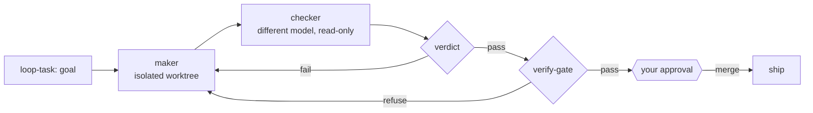

<p align="center">
  
</p>

<h1 align="center">secondmate</h1>

<p align="center">
  <em>Your agent writes the code. A different model tries to break it.<br/>Only what survives ships, and only when you say go.</em> 🐾
</p>

<p align="center">
  
  
  
  
</p>

---

**secondmate** is a Claude Code plugin that makes your AI coding agent check its own work with a second opinion.

When an agent writes code, the *same* agent usually reviews it, so it misses its own mistakes. secondmate
splits the job in two: one agent **writes** the change (the **maker**), a **different AI model reviews** it
(the **checker**), and nothing gets merged until the checker passes it, the change clears an automated safety
gate, and you give the final OK.

Because the checker is a *different model* than the maker, it catches bugs the maker is blind to. secondmate
also keeps long runs from going off the rails, remembers your decisions across restarts, and can hand hard
analysis to a reasoning model on the side. Works with any coding-agent CLI.

## ⚡ Quick start

```sh
claude plugin marketplace add eshwarvijay/secondmate
claude plugin install secondmate@secondmate
# restart Claude Code, then let it set itself up — you just approve each step:
/secondmate-doctor
```

Then run any change through the loop:

```sh
/loop-task add a rate limiter to the API and prove it works
```

secondmate spawns the maker in an isolated worktree, runs a **different model** as an edit-locked checker,
gates on its `{verdict}` plus a clean `verify-gate`, and asks you before anything merges. Need a quick
read-only analysis? `/secondmate-reason why does this test flake only in CI?`

## 🔁 How it works



> Deeper dive: **[docs/ARCHITECTURE.md](docs/ARCHITECTURE.md)** — roles, the guarantee behind every stage, and the full component map.

> 💡 **Best with [herdr](https://herdr.dev/).** Run secondmate inside herdr (a tmux-backed terminal multiplexer for coding agents) and the maker and the cross-model checker each get their own live pane you can watch and jump into: the whole loop, visible. It's how I run it, on herdr + tmux. Anywhere else it falls back to in-process sub-agents, same guards and all.

## 🧰 What's inside

| Component | What it does |
|---|---|
| `secondmate` skill | The maker/checker SOP: triage → spawn → check → gate → hold → integrate |
| SessionStart hook | Surfaces durable open decisions each session so a restart never drops a pending gate |
| `bin/hold.py` | Durable human-gate decisions (`hold` / `answer` / `open`) |
| `bin/verify-gate.sh` | Pre-integration gate: clean tree, non-empty diff, **exact-SHA** match, tests |
| `bin/launch-checker.sh` | Edit-locked (`--exclude-tools edit,write`) cross-model checker + verdict-envelope contract |
| `bin/verdict.py` | Parse the checker's `{verdict}` → exit `0` pass / `1` fail / `2` error·refused |
| `bin/loop-guard.sh` | Stuck-loop abort + per-run round cap + global spawn cap |
| `bin/run-round.sh` | Wall-clock timeout + idle watchdog + paired audit record (even on kill) |
| `bin/prune-output.sh` | Model-free head/tail truncation of bulky logs |
| `bin/new-worktree.sh` | Isolated git worktree per maker (never the primary checkout) |
| `bin/reason.sh` | Read-only, tool-free reasoning one-shot on a reasoning model |

**Commands:** `/secondmate-doctor` · `/secondmate-reason` · `/secondmate-verify` · `/loop-task`

## 📦 Requirements

`git`, `gh`, `python3`, and (recommended) a **checker harness CLI** (defaults to [`pi`](https://www.npmjs.com/package/@earendil-works/pi-coding-agent)).
Just run **`/secondmate-doctor`**: it detects and installs everything, asking only for your approval, and never
hands you a manual checklist.

**No harness? You still get a cross-model check.** secondmate falls back to a **second Claude model** as the
checker, in-session, so the maker is still not the checker. An external harness like pi gives a stronger
*cross-vendor* check (a different vendor, not just a different Claude model). Either way, the models need
credentials only you can supply.

<details>
<summary><b>Companions</b> — installed by <code>/secondmate-doctor</code></summary>

<br/>

| Companion | What it adds | Install |
|---|---|---|
| **pi** | default checker + reasoning harness (multi-model) | `npm install -g @earendil-works/pi-coding-agent` |
| **herdr** | visible multi-pane maker/checker orchestration | `brew install herdr` |
| **ponytail** | complexity / over-engineering lens | `claude plugin install ponytail@ponytail` |
| **loop-task** | maker/checker loop driver command | **bundled — ships with secondmate** |
| **adhd** | divergent ideation for open-ended triage | `claude plugin marketplace add UditAkhourii/adhd && claude plugin install adhd@adhd` |

</details>

<details>
<summary><b>Configuration</b> — env vars, all optional (sane defaults)</summary>

<br/>

| Var | Default | Purpose |
|---|---|---|
| `SM_CHECKER_HARNESS` | `pi` | checker CLI |
| `SM_CHECKER_PROVIDER` | `amazon-bedrock` | checker provider |
| `SM_CHECKER_MODEL` | `global.openai.gpt-5.6-terra` | checker model (a **different family** than the maker) |
| `SM_CHECKER_THINKING` | `high` | checker reasoning effort |
| `SM_CHECKER_PROMPT` | `bin/checker-prompt.md` | base checker discipline (point at your own to override) |
| `SM_REASON_HARNESS` | `pi` | reasoning CLI |
| `SM_REASON_PROVIDER` | `amazon-bedrock` | reasoning provider |
| `SM_REASON_MODEL` | `r1` | default reasoning model alias (`r1` / `gpt` / `sonnet` / full id) |
| `SM_HOLD_LEDGER` | `./decisions.jsonl` | per-repo decision ledger |
| `SM_LOOP_STATE` | `./.secondmate` | loop-guard state dir |
| `SM_WT_ROOT` | `~/.secondmate-worktrees` | where maker worktrees are created |

The default model IDs are Amazon Bedrock inference-profile IDs — override them for your provider.

</details>

<details>
<summary><b>Manual install &amp; verify</b></summary>

<br/>

```sh
# install from a local clone instead of GitHub
claude plugin marketplace add /path/to/secondmate
claude plugin install secondmate@secondmate

# verify everything
bin/verdict.py selfcheck && bin/loop-guard.sh selfcheck && bin/verify-gate.sh --selfcheck \
  && bin/prune-output.sh --selfcheck && bin/run-round.sh selfcheck && bin/reason.sh --selfcheck \
  && bin/doctor.sh --selfcheck && echo ALL_OK
claude plugin validate .
```

</details>

## License

[MIT](LICENSE) © Eshwar Vijay
