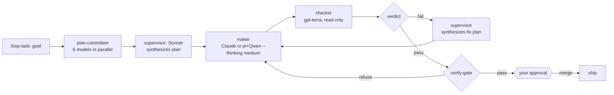

<p align="center">
  
</p>

<h1 align="center">secondmate</h1>

<p align="center">
  <em>Your agent writes the code. A different model tries to break it.<br/>Only what survives ships, and only when you say go.</em> 🐾
</p>

<p align="center">
  
  
  
  
</p>

---

**secondmate** is a Claude Code plugin that makes your AI coding agent check its own work with a second opinion.

When an agent writes code, the *same* agent usually reviews it, so it misses its own mistakes. secondmate
splits the job in two: one agent **writes** the change (the **maker**), a **different AI model reviews** it
(the **checker**), and nothing gets merged until the checker passes it, the change clears an automated safety
gate, and you give the final OK.

Because the checker is a *different model* than the maker, it catches bugs the maker is blind to. secondmate
also keeps long runs from going off the rails, remembers your decisions across restarts, and can hand hard
analysis to a reasoning model on the side. Works with any coding-agent CLI.

## ⚡ Quick start

```sh
claude plugin marketplace add eshwarvijay/secondmate
claude plugin install secondmate@secondmate
# restart Claude Code, then let it set itself up — you just approve each step:
/secondmate-doctor
```

Then run any change through the loop:

```sh
/loop-task add a rate limiter to the API and prove it works
```

secondmate spawns the maker in an isolated worktree, runs a **different model** as an edit-locked checker,
gates on its `{verdict}` plus a clean `verify-gate`, and asks you before anything merges. Need a quick
read-only analysis? `/secondmate-reason why does this test flake only in CI?`

## 🔁 How it works



> The planning committee is optional — skip it for trivial edits. For complex tasks it runs 6 open-weight models (DeepSeek-R1, Qwen3-Next-80B, Qwen3-Coder-Next, Kimi-K2, Mistral-Large-3, GLM-5) in parallel, each covering a different dimension. Sonnet synthesizes all outputs into one consolidated plan, then routes to the right maker: **Claude** for tasks needing judgment or MCP tools, **pi + Qwen3-Coder (`--thinking medium`)** for well-specified pure-code tasks.
>
> On a checker `fail`, the supervisor synthesizes a fix plan and hands it back to the **same maker** (task-scoped agent name, same worktree) — never fixes inline. The supervisor never writes project code.

> Deeper dive: **[docs/ARCHITECTURE.md](docs/ARCHITECTURE.md)** — roles, the guarantee behind every stage, and the full component map.

> 💡 **Best with [herdr](https://herdr.dev/).** Inside herdr the full loop runs natively: `herdr worktree create` spawns the maker worktree + workspace in one call; the pi maker runs as a lifecycle-tracked `herdr agent` (blocked recovery, stall detection); the checker runs via `herdr pane run` + `pane wait-output` — no timeout caps, no silent failures. Anywhere else secondmate falls back to headless sub-agents with the same guards.

## 🧰 What's inside

| Component | What it does |
|---|---|
| `secondmate` skill | The full SOP: plan-committee → triage → spawn → check → gate → hold → integrate |
| `bin/plan-committee.sh` | 6 open-weight pi planners in parallel, one dimension each → outputs for Sonnet to synthesize |
| SessionStart hook | Surfaces durable open decisions each session so a restart never drops a pending gate |
| `bin/scope-guard.py` (PreToolUse hook) | Confines a **marked maker session** to its own worktree — denies Bash/Read/Edit/Write/NotebookEdit outside it and Bash commands reading credential stores (Keychain, `gh auth`); no-op for the supervisor's primary checkout |
| `bin/hold.py` | Durable human-gate decisions (`hold` / `answer` / `open`) |
| `bin/verify-gate.sh` | Pre-integration gate: clean tree, non-empty diff, **exact-SHA** match, tests |
| `bin/launch-checker.sh` | Edit-locked (`--exclude-tools edit,write`) cross-model checker + verdict-envelope contract |
| `bin/verdict.py` | Parse the checker's `{verdict}` → exit `0` pass / `1` fail / `2` error·refused |
| `bin/loop-guard.sh` | Stuck-loop abort + per-run round cap + global spawn cap |
| `bin/run-round.sh` | Wall-clock timeout + idle watchdog + paired audit record (even on kill) |
| `bin/prune-output.sh` | Model-free head/tail truncation of bulky logs |
| `bin/new-worktree.sh` | Isolated git worktree per maker (never the primary checkout) |
| `bin/reason.sh` | Read-only, tool-free reasoning one-shot on a reasoning model |
| `bin/herdr-pane.sh` | When in [herdr](https://herdr.dev/): `spawn` starts any maker (Claude or pi) as a lifecycle-tracked agent and returns `<name> <pane_id>` for cleanup, marking its worktree for `scope-guard.py`; checker runs via `herdr pane run` + `pane wait-output` with a per-round unique marker |

**Commands:** `/secondmate-doctor` · `/secondmate-reason` · `/secondmate-verify` · `/loop-task`

## 🔎 Specialized review lenses

The checker isn't one generic reviewer. Per task, secondmate loads **only the specialized disciplines the
diff actually needs** — a router → sub-skill design (progressive disclosure), so the checker gets focused
context instead of a generic dump. Lenses live in `bin/lenses/<role>/`; the supervisor reads each role's
`ROUTER.md`, matches the diff, and injects just the matching sub-lenses
(`--lens redteam/injection --lens qa/coverage`).

| Role | Sub-lenses |
|---|---|
| **redteam** (security) | injection · access-control · server-side-requests · deserialization · secrets-supply-chain · llm |
| **qa** (tests / behavior) | test-reality · coverage · risk-flagging · behavioral-contracts |
| **reverse-engineer** (unfamiliar / third-party code) | dataflow · hidden-behavior · intent-vs-impl · unknown-code |
| **research** (groundedness) | groundedness · prior-art · assumption-audit |

Add your own: drop `bin/lenses/<role>/<name>.md` (a lean, specialized discipline) and list it in that role's `ROUTER.md`.

## 📦 Requirements

`git`, `gh`, `python3`, and (recommended) a **checker harness CLI** (defaults to [`pi`](https://www.npmjs.com/package/@earendil-works/pi-coding-agent)).
Just run **`/secondmate-doctor`**: it detects and installs everything, asking only for your approval, and never
hands you a manual checklist.

**No harness? You still get a cross-model check.** secondmate falls back to a **second Claude model** as the
checker, in-session, so the maker is still not the checker. An external harness like pi gives a stronger
*cross-vendor* check (a different vendor, not just a different Claude model). Either way, the models need
credentials only you can supply.

<details>
<summary><b>Companions</b> — installed by <code>/secondmate-doctor</code></summary>

<br/>

| Companion | What it adds | Install |
|---|---|---|
| **pi** | default checker + reasoning harness (multi-model) | `npm install -g @earendil-works/pi-coding-agent` |
| **herdr** | visible multi-pane maker/checker orchestration | `brew install herdr` |
| **ponytail** | complexity / over-engineering lens | `claude plugin install ponytail@ponytail` |
| **loop-task** | maker/checker loop driver command | **bundled — ships with secondmate** |
| **adhd** | divergent ideation for open-ended triage | `claude plugin marketplace add UditAkhourii/adhd && claude plugin install adhd@adhd` |

</details>

<details>
<summary><b>Configuration</b> — env vars, all optional (sane defaults)</summary>

<br/>

| Var | Default | Purpose |
|---|---|---|
| `SM_CHECKER_HARNESS` | `pi` | checker CLI |
| `SM_CHECKER_PROVIDER` | `amazon-bedrock` | checker provider |
| `SM_CHECKER_MODEL` | `global.openai.gpt-5.6-terra` | checker model (a **different family** than the maker) |
| `SM_CHECKER_THINKING` | `high` | checker reasoning effort |
| `SM_CHECKER_PROMPT` | `bin/checker-prompt.md` | base checker discipline (point at your own to override) |
| `SM_REASON_HARNESS` | `pi` | reasoning CLI |
| `SM_REASON_PROVIDER` | `amazon-bedrock` | reasoning provider |
| `SM_REASON_MODEL` | `r1` | default reasoning model alias (`r1` / `gpt` / `sonnet` / full id) |
| `SM_COMMITTEE_PROVIDER` | `amazon-bedrock` | planner provider for `plan-committee.sh` |
| `SM_COMMITTEE_TIMEOUT` | `300` | per-planner wall-clock timeout in seconds |
| `SM_HOLD_LEDGER` | `./decisions.jsonl` | per-repo decision ledger |
| `SM_LOOP_STATE` | `./.secondmate` | loop-guard state dir |
| `SM_WT_ROOT` | `~/.secondmate-worktrees` | where maker worktrees are created |
| `SM_MAKER_ALLOW_CREDS` | unset | set to `1` inside a maker session to opt in to credential-store commands (Keychain `security`, `gh auth`) that `scope-guard.py` otherwise denies |

The default model IDs are Amazon Bedrock inference-profile IDs — override them for your provider.

</details>

<details>
<summary><b>Manual install &amp; verify</b></summary>

<br/>

```sh
# install from a local clone instead of GitHub
claude plugin marketplace add /path/to/secondmate
claude plugin install secondmate@secondmate

# verify everything
bin/verdict.py selfcheck && bin/loop-guard.sh selfcheck && bin/verify-gate.sh --selfcheck \
  && bin/prune-output.sh --selfcheck && bin/run-round.sh selfcheck && bin/reason.sh --selfcheck \
  && bin/plan-committee.sh --selfcheck && bin/doctor.sh --selfcheck && bin/scope-guard.py selfcheck && echo ALL_OK
claude plugin validate .
```

</details>

## License

[MIT](LICENSE) © Eshwar Vijay
