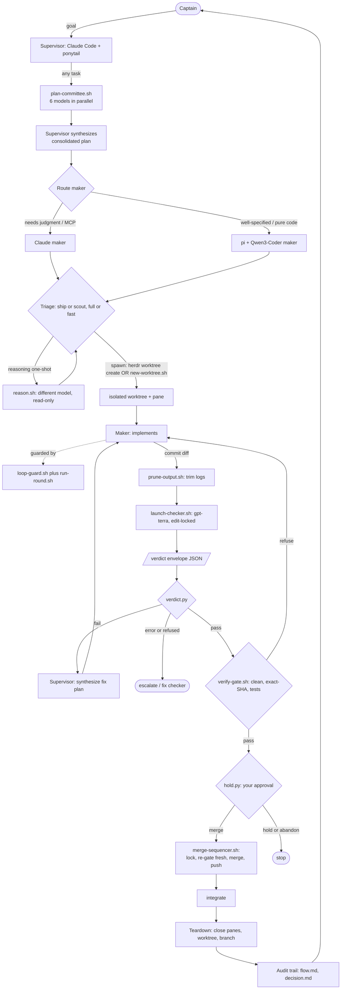

# secondmate architecture

How secondmate turns a single coding agent into a maker/checker crew that ships only verified work.

## The problem it solves

A single agent that writes *and* judges its own code has one fatal flaw: its blind spots are correlated
with itself. The same model that made a mistake tends to miss it on review, and it will happily report
"done" on code it never really verified. secondmate is a structural answer to that: separate the hands that
build from the eyes that check, make the eyes a **different model**, and never let anything irreversible
happen without a real gate and a human.

Two principles run through every component:

- **Scripts own mechanics, agents own judgment.** Anything exact and repeatable (isolating a worktree,
  comparing a SHA, counting a loop, parsing a verdict) is deterministic bash/python, never left to an LLM.
  Anything that needs understanding (writing code, adjudicating a finding) is an agent. They never mix.
- **State lives on disk, not in a conversation.** Every decision, loop counter, and audit record is a file.
  Kill any session and the next one reconciles from disk. A restart is a non-event.

## Roles

| Role | Who | Job | Constraint |
|---|---|---|---|
| **Captain** | you (human) | state intent, approve risky actions | the only merge authority |
| **Supervisor** | Claude Code (Sonnet) | plan, triage, orchestrate, adjudicate, integrate | never writes project code itself |
| **Planners** | 6 open-weight models via pi | each covers one dimension of the task in parallel | headless, read-only, no tools |
| **Maker** | Claude or pi + Qwen3-Coder | implement the change in an isolated worktree | works only in its own worktree |
| **Checker** | a *different* model (GPT-5.6-Terra) | review the diff adversarially | physically read-only, edit-locked |

The separation is the point: **maker is not checker, and they run different model families** so their
failure modes do not overlap. Planners are also a different family from both — genuine model diversity, not simulated.
The supervisor is deliberately kept out of the workshop: it commands, it does not build, so its attention scales.

## The loop



## Stage by stage

Each stage exists to close a specific failure mode.

0. **Plan Committee** *(runs unconditionally before triage for every task)*.
   `plan-committee.sh` spawns 6 headless pi planners in parallel (DeepSeek-R1, Qwen3-Next-80B,
   Qwen3-Coder-Next, Kimi-K2-Thinking, Mistral-Large-3, GLM-5), each covering one dimension of the task.
   The supervisor also runs `/adhd` as a Claude sub-agent for rapid cognitive-frame divergence.
   All outputs land in `.secondmate/planning/`. Each planner is invoked in pi JSON mode and its final assistant text is extracted with multipart-aware parsing; known tool-call token dialects, unexpected content parts, empty output, and non-`stop` completion are rejected. A rejected response is retried once with a deliberately changed prompt; a successful retry is visibly marked as self-healed, while a second bad response preserves its raw text and fails the aggregate command. The directory records its task and refuses a different task's non-empty prior output rather than overwriting it. The supervisor reads the accepted outputs, synthesizes a single
   consolidated plan (with ponytail active — speculative ideas get cut), and routes to the right maker.
   *Guards against:* a single model's blind spots dominating the plan; over-engineered implementations
   from a single perspective.

1. **Triage.** Classify the task `ship` (produces a diff) vs `scout` (report only), and a rigor tier `full`
   vs `fast`. If the answer needs hard reasoning with no tools (root-cause, plan review, pre-mortem), delegate
   a **reasoning one-shot** (`reason.sh`) on a reasoning model so the supervisor does not burn its own context.
   *Guards against:* heavyweight review on trivial edits; spending the expensive supervisor model on pure analysis.

2. **Spawn.** Two paths: `new-worktree.sh` (headless / not in herdr) or `herdr worktree create` (inside herdr)
   — creates a fresh git worktree on an `sm/<task>` branch. `herdr worktree create` additionally opens a
   dedicated herdr workspace/tab/pane; `.result.root_pane.pane_id` is used directly to start the pi maker
   agent, keeping it in its own workspace rather than the supervisor's.
   `new-worktree.sh` (and `herdr agent start --pane <root_pane_id>` for the Claude-maker path) also drops a maker marker — see
   **Scope guard** below.
   *In addition to marking, the supervisor must call `caffeinate-guard.sh start` after the worktree is created* to prevent system sleep during the session (8-hour ceiling via `-t` flag as defense-in-depth orphan cleanup). This is a no-op if already running, spawning a single long-lived guard process per session. Not marking the worktree with `mark-maker.sh` before starting the maker agent is a critical failure — scope-guard.py won't activate, letting the maker access the primary checkout. Not starting `caffeinate-guard.sh` lets the laptop sleep mid-session, leaving processes orphaned.
   *Guards against:* a maker corrupting the main tree; parallel makers colliding on one repo; unattended runs interrupted by macOS sleep.

3. **Implement (guarded).** The maker works, wrapped by two deterministic guards:
   - `run-round.sh` gives each invocation a **wall-clock timeout** and an **idle watchdog** (kills it if
     output stops growing), and writes a paired audit record **even if it is killed**, so no round ends as an
     orphaned start with no outcome.
   - `loop-guard.sh action` hashes each round's canonical action and **aborts a no-progress loop** (same action
     repeated N times, counting failed attempts too); `loop-guard.sh round` enforces a per-run round cap and a
     global spawn cap where exhaustion reports `budget-limited`, never "success".
   *Guards against:* hung rounds stalling an unattended run; models spinning on the same broken action forever.

4. **Check.** The diff is trimmed with `prune-output.sh` (model-free head/tail truncation), then
   `launch-checker.sh` runs the cross-model, edit-locked checker with the verdict-envelope contract injected.
   `launch-checker.sh` invokes `pi` with `--mode json` (after caller args, so caller's `--mode text` cannot override)
   and pipes the output through `checker-progress.py` to filter progress to stderr (live tool execution updates)
   while forwarding the final review text to stdout. The checker's final output must end with a machine-readable block:
   ```json
   {"verdict":"pass|fail|error|refused","findings":["..."],"diagnostic":"..."}
   ```
   `verdict.py` parses it and exits `0` / `1` / `2`. The supervisor branches on the exit code, never on the
   checker's prose. On `fail`: the supervisor reads findings, synthesizes a concrete fix plan, and routes it to the
   **task-scoped maker agent** (`sm-pi-<task-id>` or `sm-<task-id>`) — never fixes inline. The supervisor
   never writes project code. On `error`/`refused`: fix the checker invocation or escalate; do not loop back
   to the maker. Every fix round re-runs Check with refreshed `--live-text` and a unique round marker.
   If no checker harness is installed, `launch-checker.sh` signals `SM_NO_CHECKER_HARNESS` and
   the supervisor falls back to a second Claude model as the checker, in-session: weaker (same vendor) but the
   maker is still not the checker, and the verdict is still machine-read. After every verdict, `log-round.sh`
   appends one structured record (task, round, maker kind, verdict, caller-supplied finding-category tags,
   optional cost/duration) to the append-only `audit/metrics.jsonl` — the same round the prose audit trail
   in step 8 will also describe, but queryable across tasks instead of only readable as free text.
   *Guards against:* correlated blind spots (different model); a checker that mutates the code (edit-locked);
   non-deterministic adjudication (structured verdict vs reading vibes); round-level patterns (recurring
   finding categories, verdict rates) only visible by re-reading prose across every past task.

5. **Gate.** Before anything integrates, `verify-gate.sh` re-derives ground truth from the worktree: clean
   tree, non-empty diff vs base, tests green, and the **exact commit the checker reviewed still equals HEAD**
   (`--checked-sha`).
   *Guards against:* the deadliest hole in naive loops, a maker pushing new commits after the checker approved,
   so you merge unreviewed code. If the head moved, the gate refuses and demands a re-check.

   *A note on concurrency:* if the supervisor ever runs multiple independent sub-agent-supervisors in
   parallel (each finishing its own task's maker/checker/gate loop in its own worktree/branch around the
   same time), `verify-gate.sh` itself is unmodified and still called exactly as it already exists — but the
   *integration* step (6/7 below) routes through `bin/merge-sequencer.sh` instead of a bare `git merge`, so
   concurrent landings onto the same `main` are serialized rather than racing.

6. **Hold.** Every risky or outward-facing decision (merge, deploy, delete) becomes a durable record via
   `hold.py hold`, resolved only by `hold.py answer`. A SessionStart hook surfaces open holds at the start of
   every session. `hold`/`answer` accept an optional `--sha` that binds a decision (and its id) to the exact
   commit the human was shown; `answer` then must supply a matching `--sha`, so an approval can't be silently
   reattached to a different, later commit. `hold.py next` hands back exactly one oldest-still-open decision
   at a time, for callers (human or future multi-task dispatcher) that need to process holds one at a time,
   in order, without racing each other over the full `open` list.
   *Guards against:* a pending human decision being lost when a session dies (the human, not the agent,
   closes the gate); an approval given for one code state being silently applied to a different one that
   landed later; multiple concurrently-open holds being answered out of order or by the wrong caller.

7. **Integrate.** Only after `verdict == pass` and a `PASS` gate and an answered hold. `scout` tasks stop at a
   report and never reach here. When more than one sub-agent-supervisor may finish and try to integrate around
   the same time, integration goes through `bin/merge-sequencer.sh` rather than a bare `git merge`: before doing
   anything else, it validates that `--worktree` is an ACTUAL linked worktree of `--repo` — sharing the same
   `git-common-dir` (compared via `pwd -P` so a symlinked tmp-dir prefix like macOS's `/tmp` → `/private/tmp`
   can't cause a false mismatch), not merely an independent clone of the same repository. Commit SHAs are
   portable across clones, so an independent clone could otherwise pass `verify-gate.sh`'s own freshness check
   entirely against its own, possibly stale, local refs, while the real merge lands into `--repo`'s actual,
   newer state — silently bypassing the whole "review is fresh relative to what actually gets merged"
   guarantee. It then takes a
   singleton mkdir-based lock **anchored to `--repo` by default** (`<repo>/.secondmate/merge-sequencer.lock`,
   bounded wait, no auto-steal on a stuck lock — a human removes it manually), and **re-invokes
   `verify-gate.sh` fresh, inside that lock**, immediately before the actual merge. Anchoring the lock (and
   the ledger) to `--repo` rather than to the calling process's own ambient CWD matters because the realistic
   invocation pattern is a sub-agent-supervisor running with its CWD set to its OWN worktree (as every maker
   launched via herdr already does) — two siblings each invoking `merge-sequencer.sh` from within their own
   worktree but targeting the same `--repo` must resolve to the same lock, or they never actually serialize
   against each other at all. That fresh re-invocation — not the lock itself — is the entire
   correctness guarantee: `verify-gate.sh`'s own `git rev-parse` of `--base` is executed at call time, which is
   already fresh for this repo's real topology (one local `.git` shared by the primary checkout and every
   worktree). The lock's job is efficiency/ordering/clean-failure UX. On a fresh refusal it prints `verify-gate.sh`'s
   output verbatim and exits — no internal retry, no rebase-in-place, because a rebased diff is by definition a
   new, unapproved diff; the calling supervisor re-diffs and gets a fresh checker approval instead. Right after
   the gate passes, it independently confirms **`--branch` itself resolves to exactly `--checked-sha`** —
   `verify-gate.sh` only vouches for `--worktree`'s own HEAD, it has no opinion on the separate `--branch`
   argument that is actually merged, so without this check `--branch` could name any other, never-reviewed
   branch and this script would merge that instead of the reviewed commit; a mismatch refuses (`BRANCH_MISMATCH`,
   exit 1) exactly like a gate refusal. It then confirms `$repo` itself isn't already mid an unrelated,
   in-progress merge or otherwise dirty for a reason this invocation didn't cause (checks for a pre-existing
   `MERGE_HEAD` and a non-clean `git status` — with the EXACT paths of both self-created artifacts (the
   lock directory under `--repo/.secondmate/` AND the ledger file under `--repo/audit/`) deliberately
   excluded via a literal git pathspec, so neither one ever trips this script's own dirty-check;
   deliberately exact-path, not basename, since a basename-only exclusion would wrongly swallow any
   unrelated path elsewhere in the repo that merely shares that name) — refusing immediately (exit 2) and never attempting its own
   merge if so, because a bare `git merge` failing for THAT reason looks identical to a fresh conflict, and
   calling `merge --abort` on a conflict this invocation never started would destroy a human's own unresolved
   conflict resolution. A real git merge conflict from THIS invocation's own attempt (a genuinely different
   failure class from a gate refusal — `verify-gate.sh` doesn't check mergeability) aborts cleanly and leaves
   `main` untouched. The push to `origin` happens *inside the same lock*
   as the local merge, closing an out-of-order-push race between siblings. A failed push never reverts an
   already-landed local merge — only the push needs a manual retry. Every attempt (success or failure) appends
   one JSONL record to `audit/merge-ledger.jsonl` with a closed reason-code enum
   (`SUCCESS`/`GATE_REFUSE`/`BRANCH_MISMATCH`/`MERGE_CONFLICT`/`PUSH_FAILED`/`LOCK_TIMEOUT`) for later automated triage.
   A ledger-write failure itself (e.g. its directory colliding with a tracked file) never fails an
   otherwise-successful merge — it prints a loud `WARNING` to stderr naming the ledger path rather than
   silently reporting overall success with a missing audit record.
   *Guards against:* two sibling integrations racing onto the same `main`; a checker approval going stale
   between the last fresh check and the actual merge; a rebase silently invalidating an already-approved diff;
   a network/push hiccup triggering a destructive auto-revert of already-verified, already-landed code; merging
   an unreviewed `--branch` that never matched the actually-reviewed commit; destroying a pre-existing, unrelated
   conflict on `$repo` that this invocation didn't create; an independent/stale clone passed as `--worktree`
   defeating the freshness guarantee by passing `verify-gate.sh`'s check against its own stale local refs
   while the real merge lands into `--repo`'s actual, different state.

8. **Teardown.** Immediately after integration, close everything created for this task:
   ```bash
   herdr pane close "$ck"                              # checker pane (if visible path was used) - close BEFORE workspace removal
   herdr worktree remove --workspace <workspace-id>   # removes git worktree + herdr workspace
   git branch -d sm/<task-id>                          # delete the merged branch
   ```
   A merged task that leaves a worktree or branch behind is incomplete. The worktree must not outlive its task.

   **IMPORTANT:** `caffeinate-guard.sh stop` is SESSION-SCOPED, not per-task. Call it ONCE yourself, directly,
   only after you have confirmed EVERY task/worktree in that batch has been torn down. Never call `stop` inside
   a task's per-task teardown — sibling tasks may still be running and need sleep prevention.
   *See the Roles section above for the session guard lifecycle.*

9. **Audit trail.** After teardown, append to `audit/flow.md` (orchestration: maker path, models, rounds,
   outcome) and `audit/decision.md` (what the maker decided, checker findings, gates auto-approved or
   escalated) in the **primary checkout** — not the worktree, so no commit advances the checked SHA.
   Both files are `@`-imported in `CLAUDE.md` and auto-loaded into every session as living context.
   `audit/metrics.jsonl` (via `log-round.sh`, step 4) accumulates alongside them as the structured
   counterpart — same append-only convention, but one JSON line per round instead of prose per task.
   Commit separately. Skip for trivial one-shot edits.

## Scope guard

> **⚠️ Scope guard covers both Claude Code makers and pi makers.**
> `scope-guard.py` is a Claude Code PreToolUse hook (wired via `hooks/hooks.json`). `scope-guard-extension.ts` is
> a pi extension using the `tool_call` event (activated via `--extension "${CLAUDE_PLUGIN_ROOT}/bin/scope-guard-extension.ts"` in the pi maker launch command). Both activate via the same `mark-maker.sh` marker convention and enforce
> the same confinement rules. **Neither provides OS-level sandboxing.** A deliberately adversarial user can always
> find an encoding that bypasses string-heuristic checks. See docs/SCOPE-GUARD-PI.md for full details.

- **Activation is explicit, not inferred, and lives OUTSIDE the worktree it guards.** `bin/mark-maker.sh`
  is the single shared marking call — `new-worktree.sh`, `herdr-pane.sh spawn`, and the `herdr worktree
  create` + pi-maker path (SKILL.md step 2) all route through it, so marking can't drift out of sync across
  launch sites. It writes a marker file under a fixed, supervisor-controlled directory (default
  `~/.secondmate-markers`, override with `SM_MARKER_ROOT`), keyed by the worktree's realpath — never inside
  the tracked working tree, and never inside git's per-worktree admin dir either (an earlier revision put it
  there, but that path is still reachable via git commands run inside the worktree). Because the marker
  lives outside the worktree root entirely, the scope check below already denies any Bash/Edit/Write call
  the marked session makes against it — no separate persistence or env-var mechanism needed, and unlike an
  env var, a file on disk survives the fact that every `PreToolUse` hook invocation is a brand-new
  subprocess. The hook is a no-op unless the marker is present, so the supervisor's primary checkout, and
  any worktree secondmate didn't create, are completely unaffected. `mark-maker.sh` itself refuses to mark
  anything that isn't an isolated *linked* worktree — it compares `git rev-parse --git-dir` against
  `--git-common-dir` (equal ⇒ this is the primary checkout, refuse) — so a caller can't accidentally
  scope-guard the supervisor's own session by passing the wrong `--cwd`. And every marker-installation
  failure propagates: `herdr-pane.sh spawn` aborts rather than starting an agent that looks scoped but
  isn't (an earlier revision swallowed this with `|| true`).
- **Scope check.** Every `Bash`/`Read`/`Edit`/`Write`/`NotebookEdit` call in a marked session has its
  resolved path(s) checked against the worktree root (symlinks and `..` resolved via `realpath`). Outside
  the worktree → deny. Bash commands get a token-level scan (not a full shell parser) that also looks inside
  common evasions — shell variable indirection (`d=/etc; cat $d/x`), command substitution, inline
  interpreter one-liners (`python3 -c "..."`, `node -e "..."`), and any pipeline whose *final stage* is a
  shell interpreter (`sh`/`bash`/`zsh`/`dash`/...) — denied regardless of what feeds it (`printf`, `echo`,
  `cat`, `base64 -d`, `curl`, anything), because what a piped-in script will do can't be verified without
  executing it — plus a small denylist for credential-store commands with no filesystem path to catch
  (`security`, `gh auth`). `sh`/`bash`/`zsh`/`env -c "<code>"` **and** `eval "<code>"` both recurse the
  *entire* check (paths, credentials, interpreter code, pipelines) against the wrapped string, so wrapping
  a denied command once doesn't launder it — `~/.ssh`, `~/.aws`, etc. are already denied by the general path
  check since they resolve outside any worktree. `SM_MAKER_ALLOW_CREDS=1` is the explicit opt-in past the
  credential denylist.
- **Fail-open at the activation layer, fail-closed at the decision layer.** Can't parse the hook payload, or
  git/cwd is unavailable? Allow — a broken hook must never brick tool calls in unrelated sessions. Once a
  session is confirmed as a maker, anything unresolvable (unbalanced quoting, an unexpanded shell variable
  in a path-looking token, malformed tool input like a list where a string is expected) denies rather than
  crashing or guessing — the decision logic runs inside a try/except so no exception path can skip the deny.
- **This is a deterrent, not a sandbox — a permanent limitation, not a punch list.** `check_bash()`
  recognizes common and *literal* command and credential patterns only — a fixed vocabulary of shell
  tokens matched against the literal text of the command string. It is not a shell parser, not data-flow
  analysis, not an OS sandbox. Every round of "found a bypass, added a check for it" converges on the same
  wall: a fixed vocabulary of literal patterns cannot enumerate every way a command line can reach a file
  or a credential. It does **not** reliably catch, and will not be extended further to chase:
  - **Alternate redirection syntax** — e.g. `cat</etc/passwd` or `>/etc/foo` with no space before the
    operator; a path fused to a redirection operator is a token shape the scanner doesn't recognize.
  - **Indirect/deferred execution** — e.g. `find . -exec cat /etc/passwd \;` or
    `... | xargs -0 sh -c 'cat "$0"'`; the program invoked arrives as *data* at runtime (an `-exec`
    argument, an `xargs`-substituted parameter), not as a literal token visible ahead of execution.
  - **Interpreter code that shells out via a library call** — e.g. `python3 -c "import os;
    os.system('cat /etc/passwd')"`, Node's `child_process`, or Ruby/Perl backticks, run through an
    interpreter flag this hook already scans as *text* for path-like substrings — it doesn't parse the
    code, so a call reaching a file through the language's own exec API instead of visible path text
    defeats it.

  These three are representative, not exhaustive — new instances of the same three root causes (an
  unrecognized token shape, runtime-only data, a nested interpreter's own execution API) will keep
  surfacing for as long as this is a string heuristic. This is accepted and permanent, not a queue of gaps
  awaiting the next patch. Separately, there's a **symlink TOCTOU**: this hook approves a call *before* the
  tool's actual file operation runs, with no way to atomically bind the check to that later operation — a
  symlink that resolves in-root at check time could be swapped to point outside the worktree before the
  tool opens the file. All of the above need OS-level sandboxing (chroot/seccomp/containers) to close for
  real, which is out of scope for this hook by design — documented here, not chased with more
  pattern-matching. What this hook *does* raise is the cost of accidental or unsophisticated scope
  violations — the incident it actually defends against — not completeness against an adversarial command line.

  > **Shell whitespace variations:** The tokenization heuristic only splits on plain spaces; tabs/other whitespace
  > characters are not guaranteed to be caught as word separators. This is a documented, accepted limitation
  > matching the same decision made for `scope-guard.py`'s Bash heuristic — not a bug to be patched.

## Invariants that make it trustworthy

- **Maker is not checker, cross-model.** Enforced by launching the checker as a different harness/model,
  physically read-only (`--exclude-tools edit,write`).
- **Deterministic gating.** The merge decision is a function of exit codes and a SHA comparison, not model prose.
- **Fail-closed.** Every guard refuses on ambiguity: the gate refuses if the SHA moved, loop-guard aborts if not
  converging, exhaustion never reads as success, the checker returns `refused` rather than hanging when blocked.
- **Restart is a non-event.** Decisions, loop state, and audit trails are on disk (`decisions.jsonl`,
  `.secondmate/`, `audit.jsonl`); nothing lives only in chat.
- **Human owns risk.** Autonomy is explicit and scoped; merges and destructive actions always escalate.
- **A maker cannot leave its own worktree.** Both `scope-guard.py` (Claude) and `scope-guard-extension.ts` (pi) deny any file/command touch outside the worktree and any credential-store command, activated only by an unspoofable marker — the supervisor's own session is never affected.

## Failure modes it defends against

| Failure mode | Defended by |
|---|---|
| Model misses its own bug | cross-model checker (different family) |
| "Done" on unverified code | verify-gate re-derives ground truth |
| Merge of code the checker never saw | exact-SHA match in verify-gate |
| Agent spins on the same broken action | loop-guard stuck-loop abort |
| A round hangs forever | run-round timeout + idle watchdog |
| Pending decision lost on restart | durable holds + SessionStart hook |
| Checker silently mutates the code | edit-locked checker |
| Context bloats over a long run | prune-output + reasoning one-shots off the supervisor |
| Ambiguous adjudication | machine-readable verdict envelope |
| Maker touches files/credentials outside its scope | scope-guard.py (Claude) and scope-guard-extension.ts (pi), both marker-activated |
| Two sibling merges racing onto `main` at once | merge-sequencer.sh singleton lock + fresh re-gate inside it |
| An independent/stale clone passed as `--worktree` silently bypassing the freshness guarantee | merge-sequencer.sh validates `--worktree` shares `--repo`'s `git-common-dir` (a real linked worktree) before doing anything else |
| A network/push hiccup triggering a destructive auto-revert | merge-sequencer.sh never reverts an already-landed local merge on push failure |
| `--branch` naming a different, never-reviewed commit than `--checked-sha` | merge-sequencer.sh's branch-vs-checked-sha identity check (`BRANCH_MISMATCH`) |
| Destroying a pre-existing, unrelated conflict on the primary checkout | merge-sequencer.sh refuses before merging if `$repo` already has a `MERGE_HEAD`/is dirty; never calls `merge --abort` on a conflict it didn't start |
| The script's own lock directory or ledger file tripping its own dirty-repo guard | merge-sequencer.sh's dirty-check excludes the EXACT paths of both self-created artifacts (lock dir + ledger file) via a literal git pathspec — never a basename match, which would wrongly swallow any unrelated same-named path elsewhere in the repo |
| A ledger-write failure silently reported as full success with no audit record | merge-sequencer.sh prints a loud `WARNING` naming the ledger path; the merge/push outcome is unaffected either way |

## Component map

| Path | Guarantee |
|---|---|
| `skills/secondmate/SKILL.md` | the SOP the supervisor follows |
| `hooks/hooks.json` | SessionStart hold-surfacing + PreToolUse scope guard |
| `bin/scope-guard.py` | confines a marker-activated maker session to its own worktree; denies credential-store commands and common Bash evasions |
| `bin/mark-maker.sh` | the one shared call that drops the scope-guard marker (outside the worktree) — called by every maker-launch site; same convention for Claude and pi |
| `bin/scope-guard-extension.ts` | pi extension version of scope-guard.py — uses `tool_call` event instead of PreToolUse, same enforcement rules |
| `bin/plan-committee.sh` | 6 parallel pi planners → `.secondmate/planning/<label>.md`; JSON-validates planner output, retries a rejected response once with a changed prompt, and protects prior-task output directories |
| `bin/committee-output.py` | multipart-aware pi JSON final-text extraction and tool-call-garble classification for planners |
| `bin/new-worktree.sh` | isolated worktree per maker; marks it via `mark-maker.sh` |
| `bin/run-round.sh` | timeout + idle watchdog + audit (used by planners + maker + checker) |
| `bin/loop-guard.sh` | stuck-loop abort + round/spawn caps |
| `bin/launch-checker.sh` + `bin/checker-envelope.md` | edit-locked cross-model checker + verdict contract |
| `bin/checker-progress.py` | filter pi's --mode json output: progress to stderr, final text to stdout |
| `bin/verdict.py` | deterministic pass/fail/error branching |
| `bin/verify-gate.sh` | pre-integration ground-truth gate |
| `bin/merge-sequencer.sh` | serializes concurrent merges to `main`; validates `--worktree` is an ACTUAL linked worktree of `--repo` (matching `git-common-dir`) before doing anything else, refusing an independent/stale clone; re-invokes `verify-gate.sh` fresh inside a singleton lock immediately before merging; confirms `--branch` itself resolves to exactly `--checked-sha` (`BRANCH_MISMATCH` otherwise); refuses before merging if `$repo` already has an unrelated in-progress merge/dirty state (excluding the EXACT paths of its own lock dir and ledger file, never a basename match, from that check); refuses/aborts cleanly on gate refusal or a real merge conflict from its own attempt only; never auto-retries, never rebases, never reverts a landed merge on push failure; append-only `audit/merge-ledger.jsonl` with a closed reason-code enum, and a ledger-write failure itself is a loud stderr `WARNING`, never a silent loss |
| `bin/hold.py` | durable human-gate decisions; optional `--sha` binds a hold/answer to an exact commit, `next` serializes one-at-a-time retrieval |
| `bin/prune-output.sh` | context hygiene |
| `bin/reason.sh` | read-only reasoning one-shots |
| `bin/log-round.sh` | append-only per-round metrics ledger (`audit/metrics.jsonl`) — task, round, maker, verdict, finding-category tags, optional cost/duration |
| `bin/caffeinate-guard.sh` | macOS sleep prevention during session execution — single session-scoped guard process, PID identity verification, bounded TTL ceiling, idempotent start/stop |

Everything is parameterized via `SM_*` env vars, so the maker and checker models are swappable per environment.
