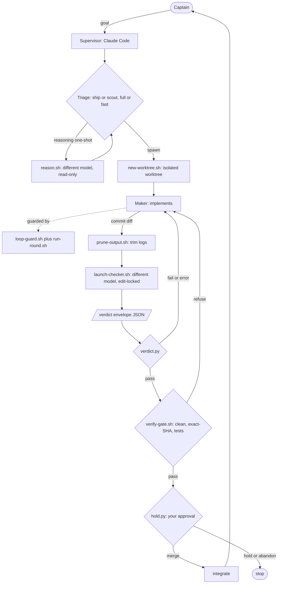

# secondmate architecture

How secondmate turns a single coding agent into a maker/checker crew that ships only verified work.

## The problem it solves

A single agent that writes *and* judges its own code has one fatal flaw: its blind spots are correlated
with itself. The same model that made a mistake tends to miss it on review, and it will happily report
"done" on code it never really verified. secondmate is a structural answer to that: separate the hands that
build from the eyes that check, make the eyes a **different model**, and never let anything irreversible
happen without a real gate and a human.

Two principles run through every component:

- **Scripts own mechanics, agents own judgment.** Anything exact and repeatable (isolating a worktree,
  comparing a SHA, counting a loop, parsing a verdict) is deterministic bash/python, never left to an LLM.
  Anything that needs understanding (writing code, adjudicating a finding) is an agent. They never mix.
- **State lives on disk, not in a conversation.** Every decision, loop counter, and audit record is a file.
  Kill any session and the next one reconciles from disk. A restart is a non-event.

## Roles

| Role | Who | Job | Constraint |
|---|---|---|---|
| **Captain** | you (human) | state intent, approve risky actions | the only merge authority |
| **Supervisor** | Claude Code | triage, orchestrate, adjudicate, integrate | never writes project code itself |
| **Maker** | Claude (or any harness) | implement the change in an isolated worktree | works only in its own worktree |
| **Checker** | a *different* model (e.g. GPT-5.6) | review the diff adversarially | physically read-only |

The separation is the point: **maker is not checker, and they run different model families** so their
failure modes do not overlap. The supervisor is deliberately kept out of the workshop: it commands, it does
not build, so its attention scales.

## The loop



## Stage by stage

Each stage exists to close a specific failure mode.

1. **Triage.** Classify the task `ship` (produces a diff) vs `scout` (report only), and a rigor tier `full`
   vs `fast`. If the answer needs hard reasoning with no tools (root-cause, plan review, pre-mortem), delegate
   a **reasoning one-shot** (`reason.sh`) on a reasoning model so the supervisor does not burn its own context.
   *Guards against:* heavyweight review on trivial edits; spending the expensive supervisor model on pure analysis.

2. **Spawn.** `new-worktree.sh` creates a fresh git worktree on an `sm/<task>` branch and asserts it is not
   the primary checkout. The maker runs there.
   *Guards against:* a maker corrupting the main tree; parallel makers colliding on one repo.

3. **Implement (guarded).** The maker works, wrapped by two deterministic guards:
   - `run-round.sh` gives each invocation a **wall-clock timeout** and an **idle watchdog** (kills it if
     output stops growing), and writes a paired audit record **even if it is killed**, so no round ends as an
     orphaned start with no outcome.
   - `loop-guard.sh action` hashes each round's canonical action and **aborts a no-progress loop** (same action
     repeated N times, counting failed attempts too); `loop-guard.sh round` enforces a per-run round cap and a
     global spawn cap where exhaustion reports `budget-limited`, never "success".
   *Guards against:* hung rounds stalling an unattended run; models spinning on the same broken action forever.

4. **Check.** The diff is trimmed with `prune-output.sh` (model-free head/tail truncation), then
   `launch-checker.sh` runs the cross-model, edit-locked checker with the verdict-envelope contract injected.
   The checker must end with a machine-readable block:
   ```json
   {"verdict":"pass|fail|error|refused","findings":["..."],"diagnostic":"..."}
   ```
   `verdict.py` parses it and exits `0` / `1` / `2`. The supervisor branches on the exit code, never on the
   checker's prose.
   *Guards against:* correlated blind spots (different model); a checker that mutates the code (edit-locked);
   non-deterministic adjudication (structured verdict vs reading vibes).

5. **Gate.** Before anything integrates, `verify-gate.sh` re-derives ground truth from the worktree: clean
   tree, non-empty diff vs base, tests green, and the **exact commit the checker reviewed still equals HEAD**
   (`--checked-sha`).
   *Guards against:* the deadliest hole in naive loops, a maker pushing new commits after the checker approved,
   so you merge unreviewed code. If the head moved, the gate refuses and demands a re-check.

6. **Hold.** Every risky or outward-facing decision (merge, deploy, delete) becomes a durable record via
   `hold.py hold`, resolved only by `hold.py answer`. A SessionStart hook surfaces open holds at the start of
   every session.
   *Guards against:* a pending human decision being lost when a session dies. The human, not the agent, closes
   the gate.

7. **Integrate.** Only after `verdict == pass` and a `PASS` gate and an answered hold. `scout` tasks stop at a
   report and never reach here.

## Invariants that make it trustworthy

- **Maker is not checker, cross-model.** Enforced by launching the checker as a different harness/model,
  physically read-only (`--exclude-tools edit,write`).
- **Deterministic gating.** The merge decision is a function of exit codes and a SHA comparison, not model prose.
- **Fail-closed.** Every guard refuses on ambiguity: the gate refuses if the SHA moved, loop-guard aborts if not
  converging, exhaustion never reads as success, the checker returns `refused` rather than hanging when blocked.
- **Restart is a non-event.** Decisions, loop state, and audit trails are on disk (`decisions.jsonl`,
  `.secondmate/`, `audit.jsonl`); nothing lives only in chat.
- **Human owns risk.** Autonomy is explicit and scoped; merges and destructive actions always escalate.

## Failure modes it defends against

| Failure mode | Defended by |
|---|---|
| Model misses its own bug | cross-model checker (different family) |
| "Done" on unverified code | verify-gate re-derives ground truth |
| Merge of code the checker never saw | exact-SHA match in verify-gate |
| Agent spins on the same broken action | loop-guard stuck-loop abort |
| A round hangs forever | run-round timeout + idle watchdog |
| Pending decision lost on restart | durable holds + SessionStart hook |
| Checker silently mutates the code | edit-locked checker |
| Context bloats over a long run | prune-output + reasoning one-shots off the supervisor |
| Ambiguous adjudication | machine-readable verdict envelope |

## Component map

| Path | Guarantee |
|---|---|
| `skills/secondmate/SKILL.md` | the SOP the supervisor follows |
| `hooks/hooks.json` | SessionStart hold-surfacing |
| `bin/new-worktree.sh` | isolated worktree per maker |
| `bin/run-round.sh` | timeout + idle watchdog + audit |
| `bin/loop-guard.sh` | stuck-loop abort + round/spawn caps |
| `bin/launch-checker.sh` + `bin/checker-envelope.md` | edit-locked cross-model checker + verdict contract |
| `bin/verdict.py` | deterministic pass/fail/error branching |
| `bin/verify-gate.sh` | pre-integration ground-truth gate |
| `bin/hold.py` | durable human-gate decisions |
| `bin/prune-output.sh` | context hygiene |
| `bin/reason.sh` | read-only reasoning one-shots |

Everything is parameterized via `SM_*` env vars, so the maker and checker models are swappable per environment.
