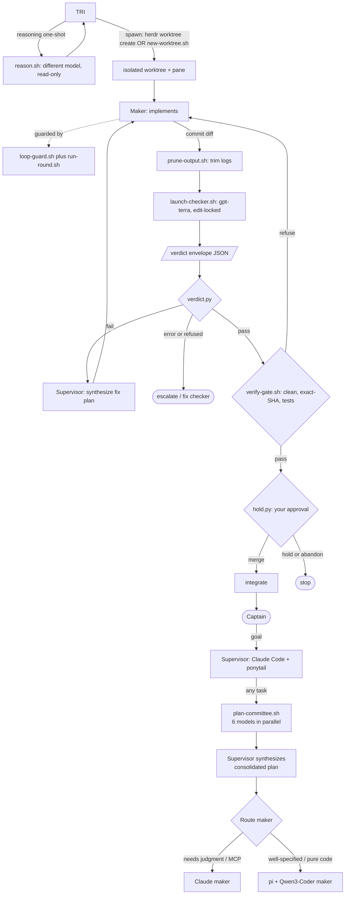

# secondmate architecture

How secondmate turns a single coding agent into a maker/checker crew that ships only verified work.

## The problem it solves

A single agent that writes *and* judges its own code has one fatal flaw: its blind spots are correlated
with itself. The same model that made a mistake tends to miss it on review, and it will happily report
"done" on code it never really verified. secondmate is a structural answer to that: separate the hands that
build from the eyes that check, make the eyes a **different model**, and never let anything irreversible
happen without a real gate and a human.

Two principles run through every component:

- **Scripts own mechanics, agents own judgment.** Anything exact and repeatable (isolating a worktree,
  comparing a SHA, counting a loop, parsing a verdict) is deterministic bash/python, never left to an LLM.
  Anything that needs understanding (writing code, adjudicating a finding) is an agent. They never mix.
- **State lives on disk, not in a conversation.** Every decision, loop counter, and audit record is a file.
  Kill any session and the next one reconciles from disk. A restart is a non-event.

## Roles

| Role | Who | Job | Constraint |
|---|---|---|---|
| **Captain** | you (human) | state intent, approve risky actions | the only merge authority |
| **Supervisor** | Claude Code (Sonnet) | plan, triage, orchestrate, adjudicate, integrate | never writes project code itself |
| **Planners** | 6 open-weight models via pi | each covers one dimension of the task in parallel | headless, read-only, no tools |
| **Maker** | Claude or pi + Qwen3-Coder | implement the change in an isolated worktree | works only in its own worktree |
| **Checker** | a *different* model (GPT-5.6-Terra) | review the diff adversarially | physically read-only, edit-locked |

The separation is the point: **maker is not checker, and they run different model families** so their
failure modes do not overlap. Planners are also a different family from both — genuine model diversity, not simulated.
The supervisor is deliberately kept out of the workshop: it commands, it does not build, so its attention scales.

## The loop



## Stage by stage

Each stage exists to close a specific failure mode.

0. **Plan Committee** *(runs unconditionally before triage for every task)*.
   `plan-committee.sh` spawns 6 headless pi planners in parallel (DeepSeek-R1, Qwen3-Next-80B,
   Qwen3-Coder-Next, Kimi-K2-Thinking, Mistral-Large-3, GLM-5), each covering one dimension of the task.
   The supervisor also runs `/adhd` as a Claude sub-agent for rapid cognitive-frame divergence.
   All outputs land in `.secondmate/planning/`. The supervisor reads them, synthesizes a single
   consolidated plan (with ponytail active — speculative ideas get cut), and routes to the right maker.
   *Guards against:* a single model's blind spots dominating the plan; over-engineered implementations
   from a single perspective.

1. **Triage.** Classify the task `ship` (produces a diff) vs `scout` (report only), and a rigor tier `full`
   vs `fast`. If the answer needs hard reasoning with no tools (root-cause, plan review, pre-mortem), delegate
   a **reasoning one-shot** (`reason.sh`) on a reasoning model so the supervisor does not burn its own context.
   *Guards against:* heavyweight review on trivial edits; spending the expensive supervisor model on pure analysis.

2. **Spawn.** Two paths: `new-worktree.sh` (headless / not in herdr) or `herdr worktree create` (inside herdr)
   — creates a fresh git worktree on an `sm/<task>` branch. `herdr worktree create` additionally opens a
   dedicated herdr workspace/tab/pane; `.result.root_pane.pane_id` is used directly to start the pi maker
   agent, keeping it in its own workspace rather than the supervisor's.
   `new-worktree.sh` (and `herdr agent start --pane <root_pane_id>` for the Claude-maker path) also drops a maker marker — see
   **Scope guard** below.
   *Guards against:* a maker corrupting the main tree; parallel makers colliding on one repo.

3. **Implement (guarded).** The maker works, wrapped by two deterministic guards:
   - `run-round.sh` gives each invocation a **wall-clock timeout** and an **idle watchdog** (kills it if
     output stops growing), and writes a paired audit record **even if it is killed**, so no round ends as an
     orphaned start with no outcome.
   - `loop-guard.sh action` hashes each round's canonical action and **aborts a no-progress loop** (same action
     repeated N times, counting failed attempts too); `loop-guard.sh round` enforces a per-run round cap and a
     global spawn cap where exhaustion reports `budget-limited`, never "success".
   *Guards against:* hung rounds stalling an unattended run; models spinning on the same broken action forever.

4. **Check.** The diff is trimmed with `prune-output.sh` (model-free head/tail truncation), then
   `launch-checker.sh` runs the cross-model, edit-locked checker with the verdict-envelope contract injected.
   On `fail`: the supervisor reads findings, synthesizes a concrete fix plan, and routes it to the
   **task-scoped maker agent** (`sm-pi-<task-id>` or `sm-<task-id>`) — never fixes inline. The supervisor
   never writes project code. On `error`/`refused`: fix the checker invocation or escalate; do not loop back
   to the maker. Every fix round re-runs Check with refreshed `--live-text` and a unique round marker.
   The checker must end with a machine-readable block:
   ```json
   {"verdict":"pass|fail|error|refused","findings":["..."],"diagnostic":"..."}
   ```
   `verdict.py` parses it and exits `0` / `1` / `2`. The supervisor branches on the exit code, never on the
   checker's prose. If no checker harness is installed, `launch-checker.sh` signals `SM_NO_CHECKER_HARNESS` and
   the supervisor falls back to a second Claude model as the checker, in-session: weaker (same vendor) but the
   maker is still not the checker, and the verdict is still machine-read.
   *Guards against:* correlated blind spots (different model); a checker that mutates the code (edit-locked);
   non-deterministic adjudication (structured verdict vs reading vibes).

5. **Gate.** Before anything integrates, `verify-gate.sh` re-derives ground truth from the worktree: clean
   tree, non-empty diff vs base, tests green, and the **exact commit the checker reviewed still equals HEAD**
   (`--checked-sha`).
   *Guards against:* the deadliest hole in naive loops, a maker pushing new commits after the checker approved,
   so you merge unreviewed code. If the head moved, the gate refuses and demands a re-check.

6. **Hold.** Every risky or outward-facing decision (merge, deploy, delete) becomes a durable record via
   `hold.py hold`, resolved only by `hold.py answer`. A SessionStart hook surfaces open holds at the start of
   every session.
   *Guards against:* a pending human decision being lost when a session dies. The human, not the agent, closes
   the gate.

7. **Integrate.** Only after `verdict == pass` and a `PASS` gate and an answered hold. `scout` tasks stop at a
   report and never reach here.

8. **Audit trail.** After integration, append to `audit/flow.md` (orchestration: maker path, models, rounds,
   outcome) and `audit/decision.md` (what the maker decided, checker findings, gates auto-approved or
   escalated) in the **primary checkout** — not the worktree, so no commit advances the checked SHA.
   Both files are `@`-imported in `CLAUDE.md` and auto-loaded into every session as living context.
   Commit separately.

## Scope guard

> **⚠️ Claude Code makers only — pi makers get NONE of this, today.** `scope-guard.py` is wired via
> `hooks/hooks.json`, a Claude Code `.claude-plugin` mechanism. A **pi maker** (SKILL.md step 0d's default
> "Simple task" route) never loads `hooks.json` and is never subject to this hook — no worktree boundary,
> no credential denylist, no Bash pattern checks, nothing below applies to it. **Routing a
> security-sensitive or otherwise high-risk task to a pi maker gets zero of these protections** until a
> pi-side mechanism exists (what can pi's `--extension` hooks actually intercept? — an open question, and a
> deliberately deferred follow-up, not something this hook does).

A real incident: a maker did ordinary-looking things — `gh pr view`, `cat` a file it assumed was local —
that touched credentials and unrelated files outside its intended scope in a different repo.
`bin/scope-guard.py`, wired as a `PreToolUse` hook in `hooks/hooks.json`, closes this structurally rather
than trusting the maker's judgment **— for Claude Code maker sessions only** (see warning above):

- **Activation is explicit, not inferred, and lives OUTSIDE the worktree it guards.** `bin/mark-maker.sh`
  is the single shared marking call — `new-worktree.sh`, `herdr-pane.sh spawn`, and the `herdr worktree
  create` + pi-maker path (SKILL.md step 2) all route through it, so marking can't drift out of sync across
  launch sites. It writes a marker file under a fixed, supervisor-controlled directory (default
  `~/.secondmate-markers`, override with `SM_MARKER_ROOT`), keyed by the worktree's realpath — never inside
  the tracked working tree, and never inside git's per-worktree admin dir either (an earlier revision put it
  there, but that path is still reachable via git commands run inside the worktree). Because the marker
  lives outside the worktree root entirely, the scope check below already denies any Bash/Edit/Write call
  the marked session makes against it — no separate persistence or env-var mechanism needed, and unlike an
  env var, a file on disk survives the fact that every `PreToolUse` hook invocation is a brand-new
  subprocess. The hook is a no-op unless the marker is present, so the supervisor's primary checkout, and
  any worktree secondmate didn't create, are completely unaffected. `mark-maker.sh` itself refuses to mark
  anything that isn't an isolated *linked* worktree — it compares `git rev-parse --git-dir` against
  `--git-common-dir` (equal ⇒ this is the primary checkout, refuse) — so a caller can't accidentally
  scope-guard the supervisor's own session by passing the wrong `--cwd`. And every marker-installation
  failure propagates: `herdr-pane.sh spawn` aborts rather than starting an agent that looks scoped but
  isn't (an earlier revision swallowed this with `|| true`).
- **Scope check.** Every `Bash`/`Read`/`Edit`/`Write`/`NotebookEdit` call in a marked session has its
  resolved path(s) checked against the worktree root (symlinks and `..` resolved via `realpath`). Outside
  the worktree → deny. Bash commands get a token-level scan (not a full shell parser) that also looks inside
  common evasions — shell variable indirection (`d=/etc; cat $d/x`), command substitution, inline
  interpreter one-liners (`python3 -c "..."`, `node -e "..."`), and any pipeline whose *final stage* is a
  shell interpreter (`sh`/`bash`/`zsh`/`dash`/...) — denied regardless of what feeds it (`printf`, `echo`,
  `cat`, `base64 -d`, `curl`, anything), because what a piped-in script will do can't be verified without
  executing it — plus a small denylist for credential-store commands with no filesystem path to catch
  (`security`, `gh auth`). `sh`/`bash`/`zsh`/`env -c "<code>"` **and** `eval "<code>"` both recurse the
  *entire* check (paths, credentials, interpreter code, pipelines) against the wrapped string, so wrapping
  a denied command once doesn't launder it — `~/.ssh`, `~/.aws`, etc. are already denied by the general path
  check since they resolve outside any worktree. `SM_MAKER_ALLOW_CREDS=1` is the explicit opt-in past the
  credential denylist.
- **Fail-open at the activation layer, fail-closed at the decision layer.** Can't parse the hook payload, or
  git/cwd is unavailable? Allow — a broken hook must never brick tool calls in unrelated sessions. Once a
  session is confirmed as a maker, anything unresolvable (unbalanced quoting, an unexpanded shell variable
  in a path-looking token, malformed tool input like a list where a string is expected) denies rather than
  crashing or guessing — the decision logic runs inside a try/except so no exception path can skip the deny.
- **This is a deterrent, not a sandbox — a permanent limitation, not a punch list.** `check_bash()`
  recognizes common and *literal* command and credential patterns only — a fixed vocabulary of shell
  tokens matched against the literal text of the command string. It is not a shell parser, not data-flow
  analysis, not an OS sandbox. Every round of "found a bypass, added a check for it" converges on the same
  wall: a fixed vocabulary of literal patterns cannot enumerate every way a command line can reach a file
  or a credential. It does **not** reliably catch, and will not be extended further to chase:
  - **Alternate redirection syntax** — e.g. `cat</etc/passwd` or `>/etc/foo` with no space before the
    operator; a path fused to a redirection operator is a token shape the scanner doesn't recognize.
  - **Indirect/deferred execution** — e.g. `find . -exec cat /etc/passwd \;` or
    `... | xargs -0 sh -c 'cat "$0"'`; the program invoked arrives as *data* at runtime (an `-exec`
    argument, an `xargs`-substituted parameter), not as a literal token visible ahead of execution.
  - **Interpreter code that shells out via a library call** — e.g. `python3 -c "import os;
    os.system('cat /etc/passwd')"`, Node's `child_process`, or Ruby/Perl backticks, run through an
    interpreter flag this hook already scans as *text* for path-like substrings — it doesn't parse the
    code, so a call reaching a file through the language's own exec API instead of visible path text
    defeats it.

  These three are representative, not exhaustive — new instances of the same three root causes (an
  unrecognized token shape, runtime-only data, a nested interpreter's own execution API) will keep
  surfacing for as long as this is a string heuristic. This is accepted and permanent, not a queue of gaps
  awaiting the next patch. Separately, there's a **symlink TOCTOU**: this hook approves a call *before* the
  tool's actual file operation runs, with no way to atomically bind the check to that later operation — a
  symlink that resolves in-root at check time could be swapped to point outside the worktree before the
  tool opens the file. All of the above need OS-level sandboxing (chroot/seccomp/containers) to close for
  real, which is out of scope for this hook by design — documented here, not chased with more
  pattern-matching. What this hook *does* raise is the cost of accidental or unsophisticated scope
  violations — the incident it actually defends against — not completeness against an adversarial command line.

## Invariants that make it trustworthy

- **Maker is not checker, cross-model.** Enforced by launching the checker as a different harness/model,
  physically read-only (`--exclude-tools edit,write`).
- **Deterministic gating.** The merge decision is a function of exit codes and a SHA comparison, not model prose.
- **Fail-closed.** Every guard refuses on ambiguity: the gate refuses if the SHA moved, loop-guard aborts if not
  converging, exhaustion never reads as success, the checker returns `refused` rather than hanging when blocked.
- **Restart is a non-event.** Decisions, loop state, and audit trails are on disk (`decisions.jsonl`,
  `.secondmate/`, `audit.jsonl`); nothing lives only in chat.
- **Human owns risk.** Autonomy is explicit and scoped; merges and destructive actions always escalate.
- **A maker cannot leave its own worktree.** `scope-guard.py` denies any file/command touch outside it and
  any credential-store command, activated only by an unspoofable marker — the supervisor's own session is
  never affected.

## Failure modes it defends against

| Failure mode | Defended by |
|---|---|
| Model misses its own bug | cross-model checker (different family) |
| "Done" on unverified code | verify-gate re-derives ground truth |
| Merge of code the checker never saw | exact-SHA match in verify-gate |
| Agent spins on the same broken action | loop-guard stuck-loop abort |
| A round hangs forever | run-round timeout + idle watchdog |
| Pending decision lost on restart | durable holds + SessionStart hook |
| Checker silently mutates the code | edit-locked checker |
| Context bloats over a long run | prune-output + reasoning one-shots off the supervisor |
| Ambiguous adjudication | machine-readable verdict envelope |
| Maker touches files/credentials outside its scope | scope-guard.py PreToolUse hook, marker-activated |

## Component map

| Path | Guarantee |
|---|---|
| `skills/secondmate/SKILL.md` | the SOP the supervisor follows |
| `hooks/hooks.json` | SessionStart hold-surfacing + PreToolUse scope guard |
| `bin/scope-guard.py` | confines a marker-activated maker session to its own worktree; denies credential-store commands and common Bash evasions |
| `bin/mark-maker.sh` | the one shared call that drops the scope-guard marker (outside the worktree) — called by every maker-launch site |
| `bin/plan-committee.sh` | 6 parallel pi planners → `.secondmate/planning/<label>.md` |
| `bin/new-worktree.sh` | isolated worktree per maker; marks it via `mark-maker.sh` |
| `bin/run-round.sh` | timeout + idle watchdog + audit (used by planners + maker + checker) |
| `bin/loop-guard.sh` | stuck-loop abort + round/spawn caps |
| `bin/launch-checker.sh` + `bin/checker-envelope.md` | edit-locked cross-model checker + verdict contract |
| `bin/verdict.py` | deterministic pass/fail/error branching |
| `bin/verify-gate.sh` | pre-integration ground-truth gate |
| `bin/hold.py` | durable human-gate decisions |
| `bin/prune-output.sh` | context hygiene |
| `bin/reason.sh` | read-only reasoning one-shots |

Everything is parameterized via `SM_*` env vars, so the maker and checker models are swappable per environment.
