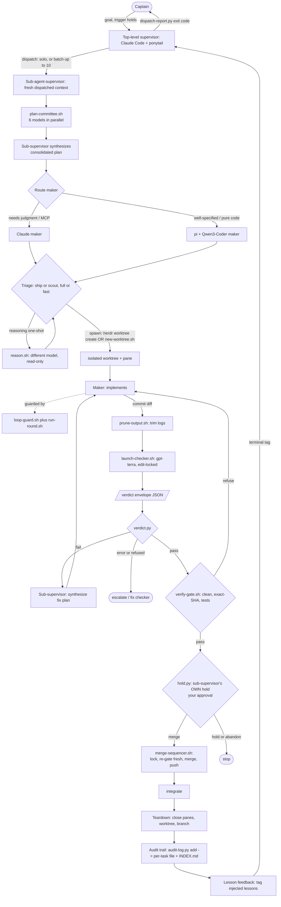

# secondmate architecture

How secondmate turns a single coding agent into a maker/checker crew that ships only verified work.

## The problem it solves

A single agent that writes *and* judges its own code has one fatal flaw: its blind spots are correlated
with itself. The same model that made a mistake tends to miss it on review, and it will happily report
"done" on code it never really verified. secondmate is a structural answer to that: separate the hands that
build from the eyes that check, make the eyes a **different model**, and never let anything irreversible
happen without a real gate and a human.

Two principles run through every component:

- **Scripts own mechanics, agents own judgment.** Anything exact and repeatable (isolating a worktree,
  comparing a SHA, counting a loop, parsing a verdict) is deterministic bash/python, never left to an LLM.
  Anything that needs understanding (writing code, adjudicating a finding) is an agent. They never mix.
- **State lives on disk, not in a conversation.** Every decision, loop counter, and audit record is a file.
  Kill any session and the next one reconciles from disk. A restart is a non-event.

## Roles

| Role | Who | Job | Constraint |
|---|---|---|---|
| **Captain** | you (human) | state intent, approve risky actions | the only merge authority |
| **Top-level supervisor** | Claude Code (Sonnet), human-facing | recognize the trigger, dispatch a fresh sub-agent-supervisor, watch for progress/staleness, relay stuck/hold situations verbatim, stay free for the next input | never runs the maker/checker/gate/hold/merge loop itself once the trigger fires |
| **Sub-agent-supervisor** | Claude Code (Sonnet), dispatched | plan, triage, orchestrate, adjudicate, integrate — the loop's stages 0-10 all run here | never writes project code itself |
| **Planners** | 6 open-weight models via pi | each covers one dimension of the task in parallel | headless, edit-locked (Read/Grep/Bash, no edit/write) |
| **Maker** | Claude or pi + Qwen3-Coder | implement the change in an isolated worktree | works only in its own worktree |
| **Checker** | a *different* model (GPT-5.6-Terra) | review the diff adversarially | physically read-only, edit-locked |

The separation is the point: **maker is not checker, and they run different model families** so their
failure modes do not overlap. Planners are also a different family from both — genuine model diversity, not simulated.
The top-level supervisor is kept out of the workshop entirely: it dispatches, it does not build or adjudicate,
so its own attention scales across however many tasks it hands off. The dispatched sub-agent-supervisor is
where "never writes project code itself" actually applies — it commands the maker/checker/gate/hold/merge
loop for its one task, but never builds.

## The loop


```mermaid
flowchart TD
    Cap([Captain]) -->|goal, trigger holds| SUP[Top-level supervisor: Claude Code + ponytail]
    SUP -->|dispatch: solo, or batch up to 10| SS[Sub-agent-supervisor: fresh dispatched context]
    SS --> PC[plan-committee.sh<br/>6 models in parallel]
    PC --> SYN[Sub-supervisor synthesizes<br/>consolidated plan]
    SYN --> ROUTE{Route maker}
    ROUTE -->|needs judgment / MCP| MKC[Claude maker]
    ROUTE -->|well-specified / pure code| MKQ[pi + Qwen3-Coder maker]
    MKC --> TRI{Triage: ship or scout, full or fast}
    MKQ --> TRI
    TRI -->|reasoning one-shot| RS[reason.sh: different model, read-only]
    RS --> TRI
    TRI -->|spawn: herdr worktree create OR new-worktree.sh| WT[isolated worktree + pane]
    WT --> MK[Maker: implements]
    MK -. guarded by .-> GD[loop-guard.sh plus run-round.sh]
    MK -->|commit diff| PR[prune-output.sh: trim logs]
    PR --> CH[launch-checker.sh: gpt-terra, edit-locked]
    CH --> EV[/verdict envelope JSON/]
    EV --> VD{verdict.py}
    VD -->|fail| S3[Sub-supervisor: synthesize fix plan]
    S3 --> MK
    VD -->|error or refused| STOP2([escalate / fix checker])
    VD -->|pass| GT{verify-gate.sh: clean, exact-SHA, tests}
    GT -->|refuse| MK
    GT -->|pass| HD{hold.py: sub-supervisor's OWN hold<br/>your approval}
    HD -->|merge| MS[merge-sequencer.sh:<br/>lock, re-gate fresh, merge, push]
    HD -->|hold or abandon| STOP([stop])
    MS --> INT[integrate]
    INT --> TD[Teardown: close panes, worktree, branch]
    TD --> AU[Audit trail: audit-log.py add -> per-task file + INDEX.md]
    AU --> LF[Lesson feedback: tag injected lessons]
    LF -->|terminal tag| SUP
    SUP -->|dispatch-report.py exit code| Cap
```

## Stage by stage

Each stage exists to close a specific failure mode. Stages 0-10 below all run inside a **dispatched
sub-agent-supervisor's** own context, never the top-level, human-facing supervisor's — dispatch (solo for
one task, batched for up to 10 concurrent) is the one path once the trigger fires, not an alternative to
this loop. See "Primitives for dispatched sub-agent-supervisors" further down for the dispatch mechanics
themselves.

0. **Plan Committee** *(runs unconditionally before triage for every task)*.
   `plan-committee.sh` spawns 6 headless pi planners in parallel (DeepSeek-R1, Qwen3-Next-80B,
   Qwen3-Coder-Next, Kimi K3 (bedrock cross-region inference profile: global.moonshotai.kimi-k3),
   Mistral-Large-3, GLM-5), each covering one dimension of the task.
   The supervisor also runs `/adhd` as a Claude sub-agent for rapid cognitive-frame divergence.
   All outputs land in `.secondmate/planning/`. Each planner is invoked in pi JSON mode and its final assistant text is extracted with multipart-aware parsing; known tool-call token dialects, unexpected content parts, empty output, and non-`stop` completion are rejected. A rejected response is retried once with a deliberately changed prompt; a successful retry is visibly marked as self-healed, while a second bad response preserves its raw text and fails the aggregate command. The directory records its task and refuses a different task's non-empty prior output rather than overwriting it. The supervisor reads the accepted outputs, synthesizes a single
   consolidated plan (with ponytail active — speculative ideas get cut), and routes to the right maker.
   *Guards against:* a single model's blind spots dominating the plan; over-engineered implementations
   from a single perspective.

1. **Triage.** Classify the task `ship` (produces a diff) vs `scout` (report only), and a rigor tier `full`
   vs `fast`. If the answer needs hard reasoning with no tools (root-cause, plan review, pre-mortem), delegate
   a **reasoning one-shot** (`reason.sh`) on a reasoning model so the supervisor does not burn its own context.
   *Guards against:* heavyweight review on trivial edits; spending the expensive supervisor model on pure analysis.

2. **Spawn.** Two paths: `new-worktree.sh` (headless / not in herdr) or `herdr worktree create` (inside herdr)
   — creates a fresh git worktree on an `sm/<task>` branch. `herdr worktree create` additionally opens a
   dedicated herdr workspace/tab/pane; `.result.root_pane.pane_id` is used directly to start the pi maker
   agent, keeping it in its own workspace rather than the supervisor's.
   `new-worktree.sh` (and `herdr agent start --pane <root_pane_id>` for the Claude-maker path) also drops a maker marker — see
   **Scope guard** below.
   *In addition to marking, the supervisor must call `caffeinate-guard.sh start` after the worktree is created* to prevent system sleep during the session (8-hour ceiling via `-t` flag as defense-in-depth orphan cleanup). This is a no-op if already running, spawning a single long-lived guard process per session. Not marking the worktree with `mark-maker.sh` before starting the maker agent is a critical failure — scope-guard.py won't activate, letting the maker access the primary checkout. Not starting `caffeinate-guard.sh` lets the laptop sleep mid-session, leaving processes orphaned.
   *Guards against:* a maker corrupting the main tree; parallel makers colliding on one repo; unattended runs interrupted by macOS sleep.

3. **Implement (guarded).** The maker works, wrapped by two deterministic guards:
   - `run-round.sh` gives each invocation a **wall-clock timeout** and an **idle watchdog** (kills it if
     output stops growing), and writes a paired audit record **even if it is killed**, so no round ends as an
     orphaned start with no outcome.
   - `loop-guard.sh action` hashes each round's canonical action and **aborts a no-progress loop** (same action
     repeated N times, counting failed attempts too); `loop-guard.sh round` enforces a per-run round cap and a
     global spawn cap where exhaustion reports `budget-limited`, never "success".
     **Machine-parseable restart signal**: for `n >= 3` repeats (before `ABORT_REPEATS`), `loop-guard.sh action`
     prints `RESTART: identical action nx — kill this maker and restart fresh with the round-state handoff file.`
     and exits `5` to signal the supervisor to kill and restart the maker with fresh state
     (`SM_ROUND_STATE:-${SM_LOOP_STATE:-.secondmate}/round-state.md`).
   - The **maker prompt closing boilerplate** (SKILL.md, appended to every maker invocation) is what actually
     writes and reads that continuity state: every maker atomically writes `round-state.md`'s four prose
     sections (Objective, Active, Blocked, Next Move), and — only when the task decomposed into checkable
     sub-goals — a cumulative, current-state `feature-list.json` ledger (`{id, description, status,
     verified_by, round}`, same atomic temp-file+mv idiom, optional and never required for a single-round
     task). Both files are injected back into every subsequent prompt (first round, fix round, or restart)
     via the identical conditional pattern in SKILL.md's command-substitution block —
     `$([ -f <path> ] && cat <path>)` — never an unconditional cat: `round-state.md` produces real content
     from round 2 onward, once the maker has actually written one; `feature-list.json` produces real
     content only for a task that decomposed into sub-goals and created one, and zero bytes for every
     other task, including any task's own first round. Before that, the
     boilerplate requires a **session-startup checklist**: read both files
     if present, check `git log` for committed work the handoff might not mention, and re-run the test/build
     command if the handoff doesn't already show a fresh result — treating both files' claims as
     self-reported, not verified. It also enforces a **premature-victory guard**: a maker cannot reply DONE
     on code inspection alone — it must show an actual test/build/live-check result, either as a
     `feature-list.json` `verified_by` citation or named in round-state.md's Active/Next Move section.
   *Guards against:* hung rounds stalling an unattended run; models spinning on the same broken action forever;
   a restarted maker re-doing already-committed work or trusting an untested self-reported claim; a maker
   declaring victory without having run anything.

4. **Check.** The diff is trimmed with `prune-output.sh` (model-free head/tail truncation), then
   `launch-checker.sh` runs the cross-model, edit-locked checker with the verdict-envelope contract injected.
   `launch-checker.sh` invokes `pi` with `--mode json` (after caller args, so caller's `--mode text` cannot override)
   and pipes the output through `checker-progress.py` to filter progress to stderr (live tool execution updates)
   while forwarding the final review text to stdout. The checker's final output must end with a machine-readable block:
   ```json
   {"verdict":"pass|fail|error|refused","findings":["..."],"diagnostic":"..."}
   ```
   `verdict.py` parses it and exits `0` / `1` / `2`. The supervisor branches on the exit code, never on the
   checker's prose. On `fail`: the supervisor reads findings, synthesizes a concrete fix plan, and routes it to the
   **task-scoped maker agent** (`sm-pi-<task-id>` or `sm-<task-id>`) — never fixes inline. The supervisor
   never writes project code. On `error`/`refused`: fix the checker invocation or escalate; do not loop back
   to the maker. Every fix round re-runs Check with refreshed `--live-text` and a unique round marker.
   If no checker harness is installed, `launch-checker.sh` signals `SM_NO_CHECKER_HARNESS` and
   the supervisor falls back to a second Claude model as the checker, in-session: weaker (same vendor) but the
   maker is still not the checker, and the verdict is still machine-read. After every verdict, `log-round.sh`
   appends one structured record (task, round, maker kind, verdict, caller-supplied finding-category tags,
   optional cost/duration) to the append-only `audit/metrics.jsonl` — the same round the prose audit trail
   in step 8 will also describe, but queryable across tasks instead of only readable as free text.
   *Guards against:* correlated blind spots (different model); a checker that mutates the code (edit-locked);
   non-deterministic adjudication (structured verdict vs reading vibes); round-level patterns (recurring
   finding categories, verdict rates) only visible by re-reading prose across every past task.

5. **Gate.** Before anything integrates, `verify-gate.sh` re-derives ground truth from the worktree: clean
   tree, non-empty diff vs base, tests green, and the **exact commit the checker reviewed still equals HEAD**
   (`--checked-sha`).
   *Guards against:* the deadliest hole in naive loops, a maker pushing new commits after the checker approved,
   so you merge unreviewed code. If the head moved, the gate refuses and demands a re-check.

   *A note on concurrency:* if the supervisor ever runs multiple independent sub-agent-supervisors in
   parallel (each finishing its own task's maker/checker/gate loop in its own worktree/branch around the
   same time), `verify-gate.sh` itself is unmodified and still called exactly as it already exists — but the
   *integration* step (6/7 below) routes through `bin/merge-sequencer.sh` instead of a bare `git merge`, so
   concurrent landings onto the same `main` are serialized rather than racing.

6. **Hold.** Every risky or outward-facing decision (merge, deploy, delete) becomes a durable record via
   `hold.py hold`, resolved only by `hold.py answer`. A SessionStart hook surfaces open holds at the start of
   every session. `hold`/`answer` accept an optional `--sha` that binds a decision (and its id) to the exact
   commit the human was shown; `answer` then must supply a matching `--sha`, so an approval can't be silently
   reattached to a different, later commit. `hold.py next` hands back exactly one oldest-still-open decision
   at a time, for callers (human or future multi-task dispatcher) that need to process holds one at a time,
   in order, without racing each other over the full `open` list. A successful `answer` prints an advisory
   one-line reminder that the decision should represent a genuine human call — it cannot verify who is
   actually behind the keyboard, so it can only remind, never enforce; a self-answered hold is a real,
   recorded incident class (`bin/audit-log.py search "self-answered"` finds it in `audit/decision/`).
   *Guards against:* a pending human decision being lost when a session dies (the human, not the agent,
   closes the gate); an approval given for one code state being silently applied to a different one that
   landed later; multiple concurrently-open holds being answered out of order or by the wrong caller.

7. **Integrate.** Only after `verdict == pass` and a `PASS` gate and an answered hold. `scout` tasks stop at a
   report and never reach here. When more than one sub-agent-supervisor may finish and try to integrate around
   the same time, integration goes through `bin/merge-sequencer.sh` rather than a bare `git merge`: before doing
   anything else, it validates that `--worktree` is an ACTUAL linked worktree of `--repo` — sharing the same
   `git-common-dir` (compared via `pwd -P` so a symlinked tmp-dir prefix like macOS's `/tmp` → `/private/tmp`
   can't cause a false mismatch), not merely an independent clone of the same repository. Commit SHAs are
   portable across clones, so an independent clone could otherwise pass `verify-gate.sh`'s own freshness check
   entirely against its own, possibly stale, local refs, while the real merge lands into `--repo`'s actual,
   newer state — silently bypassing the whole "review is fresh relative to what actually gets merged"
   guarantee. It then takes a
   singleton mkdir-based lock **anchored to `--repo` by default** (`<repo>/.secondmate/merge-sequencer.lock`,
   bounded wait, no auto-steal on a stuck lock — a human removes it manually), and **re-invokes
   `verify-gate.sh` fresh, inside that lock**, immediately before the actual merge. Right before that real
   merge (never on `--preflight-only`, which is read-only by design), it prints an advisory reminder to
   confirm `.claude-plugin/plugin.json`'s version and README/ARCHITECTURE docs are synced — a static
   textual echo, not a diff/history check; this repo's own CLAUDE.md already requires that sync before
   every push, and a missed bump is a real, recurring incident class (searchable in `audit/decision/` via
   `bin/audit-log.py search`). Anchoring the lock (and
   the ledger) to `--repo` rather than to the calling process's own ambient CWD matters because the realistic
   invocation pattern is a sub-agent-supervisor running with its CWD set to its OWN worktree (as every maker
   launched via herdr already does) — two siblings each invoking `merge-sequencer.sh` from within their own
   worktree but targeting the same `--repo` must resolve to the same lock, or they never actually serialize
   against each other at all. That fresh re-invocation — not the lock itself — is the entire
   correctness guarantee: `verify-gate.sh`'s own `git rev-parse` of `--base` is executed at call time, which is
   already fresh for this repo's real topology (one local `.git` shared by the primary checkout and every
   worktree). The lock's job is efficiency/ordering/clean-failure UX. On a fresh refusal it prints `verify-gate.sh`'s
   output verbatim and exits — no internal retry, no rebase-in-place, because a rebased diff is by definition a
   new, unapproved diff; the calling supervisor re-diffs and gets a fresh checker approval instead. Right after
   the gate passes, it independently confirms **`--branch` itself resolves to exactly `--checked-sha`** —
   `verify-gate.sh` only vouches for `--worktree`'s own HEAD, it has no opinion on the separate `--branch`
   argument that is actually merged, so without this check `--branch` could name any other, never-reviewed
   branch and this script would merge that instead of the reviewed commit; a mismatch refuses (`BRANCH_MISMATCH`,
   exit 1) exactly like a gate refusal. It then confirms `$repo` itself isn't already mid an unrelated,
   in-progress merge or otherwise dirty for a reason this invocation didn't cause (checks for a pre-existing
   `MERGE_HEAD` and a non-clean `git status` — with the EXACT paths of both self-created artifacts (the
   lock directory under `--repo/.secondmate/` AND the ledger file under `--repo/audit/`) deliberately
   excluded via a literal git pathspec, so neither one ever trips this script's own dirty-check;
   deliberately exact-path, not basename, since a basename-only exclusion would wrongly swallow any
   unrelated path elsewhere in the repo that merely shares that name) — refusing immediately (exit 2) and never attempting its own
   merge if so, because a bare `git merge` failing for THAT reason looks identical to a fresh conflict, and
   calling `merge --abort` on a conflict this invocation never started would destroy a human's own unresolved
   conflict resolution. A failed `git merge` from THIS invocation's own attempt (a genuinely different
   failure class from a gate refusal — `verify-gate.sh` doesn't check mergeability) aborts cleanly and leaves
   `main` untouched — but WHICH reason code it's logged under depends on whether a real content conflict
   actually happened: `git ls-files -u` (unmerged paths) non-empty means a genuine conflict (`MERGE_CONFLICT`);
   empty means git refused before ever attempting a real three-way merge, most commonly a repo-configured
   `pre-merge-commit` policy hook (sign-off requirements, commit-message linting, etc.) — classified as
   `MERGE_REJECTED` instead, quoting git's own actual output, so a human/dispatcher reaches for the right
   remediation (fix the policy issue) rather than a conflict-resolution path that was never applicable. The
   push to `origin` happens *inside the same lock*
   as the local merge, closing an out-of-order-push race between siblings. A push that fails for any OTHER
   reason (e.g. a hook/protected-branch rejection) never reverts an already-landed local merge — only the push
   needs a manual retry. A push that fails specifically because origin genuinely advanced between merge and
   push (requiring BOTH a race-shaped keyword AND git's own bare `[rejected]` structural summary line, never a
   keyword alone -- arbitrary local text, whether from a hook, a transport helper, or a proxy, has no reason
   to replicate that exact git-generated line; distinguished from a hook/protected-branch rejection even
   when its own message happens to contain a race-shaped word, and from a genuine concurrent server-side
   ref-transaction race via git's own client-generated rejection reason rather than any hook-influenced text)
   is recovered automatically: the singleton lock stays held through the ENTIRE recovery sequence (never
   released mid-recovery — an earlier revision released it per-attempt, letting a second concurrent
   invocation mutate the same primary checkout while the first was still recovering), fetch, merge
   `origin/<base>` in with a distinctive `merge-sequencer: race recovery (attempt N/3)` commit, retry the
   push — bounded at 3 total attempts (the initial push plus 2 retries, never a 4th); the retry loop only
   continues when a failure is still affirmatively race-shaped, never by default, so an unrelated failure
   mid-recovery (a hook rejection, an auth/network error) escalates immediately instead of burning a
   pointless further attempt. **Accepted limitation:** a LOCAL `pre-push` hook (client-side, carries none of
   the "remote: " framing this classification relies on) can defeat this text-based detection entirely — if
   `$repo` has (or at any point during the invocation acquires) one, race auto-recovery is disabled for that
   repo; checked before the first push AND monotonically re-checked (never reset once true) before every
   retry, so a hook can't evade detection either by deleting itself afterward or by only appearing
   mid-recovery. The one thing that stays un-closed: the exact instant between any single sample and the push
   it's immediately followed by. A separate, broader accepted limitation: every classifier here trusts that
   `git` in `PATH` is the genuine, unmodified system binary -- a PATH/transport-helper substitute could
   fabricate any of these structural markers, the same class of threat `bin/caffeinate-guard.sh` already
   declines to defend against. `--preflight-only` runs `git merge-tree --write-tree` against a
   freshly-fetched `origin/<base>` to detect a conflict before ever acquiring the lock or touching `$repo`'s
   working tree, index, branch refs, or ledger (`--branch` must still resolve to exactly `--checked-sha`) —
   read-only with respect to those five things specifically, not with respect to fetch's/`merge-tree`'s own
   ordinary git-internal footprint (`.git/FETCH_HEAD`, downloaded objects, an unreachable dangling
   merge-result tree), which is outside that guarantee. Every attempt (success or failure) appends
   one JSONL record to `audit/merge-ledger.jsonl` with a closed reason-code enum
   (`SUCCESS`/`GATE_REFUSE`/`BRANCH_MISMATCH`/`MERGE_CONFLICT`/`MERGE_REJECTED`/`PUSH_FAILED`/`PUSH_RACE_RECOVERED`/`PUSH_RACE_EXHAUSTED`/`LOCK_TIMEOUT`) for later automated triage.
   A ledger-write failure itself (e.g. its directory colliding with a tracked file) never fails an
   otherwise-successful merge — it prints a loud `WARNING` to stderr naming the ledger path rather than
   silently reporting overall success with a missing audit record.
   *Guards against:* two sibling integrations racing onto the same `main`; a checker approval going stale
   between the last fresh check and the actual merge; a rebase silently invalidating an already-approved diff;
   a network/push hiccup triggering a destructive auto-revert of already-verified, already-landed code; merging
   an unreviewed `--branch` that never matched the actually-reviewed commit; destroying a pre-existing, unrelated
   conflict on `$repo` that this invocation didn't create; an independent/stale clone passed as `--worktree`
   defeating the freshness guarantee by passing `verify-gate.sh`'s check against its own stale local refs
   while the real merge lands into `--repo`'s actual, different state.

8. **Teardown.** Immediately after integration, close everything created for this task:
   ```bash
   herdr pane close "$ck"                              # checker pane (if visible path was used) - close BEFORE workspace removal
   herdr worktree remove --workspace <workspace-id>   # removes git worktree + herdr workspace
   git branch -d sm/<task-id>                          # delete the merged branch
   ```
   A merged task that leaves a worktree or branch behind is incomplete. The worktree must not outlive its task.
   `bin/teardown-check.sh --task-id <id> --repo <repo>` runs immediately after as an advisory confirmation:
   it independently checks whether a git worktree, the `sm/<task-id>` branch, a herdr pane/agent, or a
   `claim-ledger.py` entry for this task-id is still around — exit 0 clean, nonzero if anything's still
   present, per its own printed report. It cannot verify HOW anything got left behind, only THAT it did;
   the supervisor decides what to do with a nonzero report. A headless run with no herdr to check reports
   that specific check as its own "unknown" condition rather than a false "clean", but that alone never
   blocks an otherwise-clean headless teardown from reporting success. **Accepted limitation:** its herdr
   check covers maker agents only (`sm-<task-id>`/`sm-pi-<task-id>`) — a leaked visible checker pane
   (the "Checker pane" recipe's `herdr-pane.sh split`) has no task-id-derived identity anywhere in this
   repo's current herdr integration, so it's invisible to this check and would report clean; closing that
   would need a new pane-naming/discovery convention touching the shared checker-pane recipe every task
   uses, out of scope here.

   **IMPORTANT:** `caffeinate-guard.sh stop` is SESSION-SCOPED, not per-task. Call it ONCE yourself, directly,
   only after you have confirmed EVERY task/worktree in that batch has been torn down. Never call `stop` inside
   a task's per-task teardown — sibling tasks may still be running and need sleep prevention.
   *See the Roles section above for the session guard lifecycle.*

9. **Audit trail.** After teardown, in the **primary checkout** — not the worktree, so no commit advances
   the checked SHA — file one entry per task via `bin/audit-log.py add --type flow ...` (orchestration:
   maker path, models, rounds, outcome) and `bin/audit-log.py add --type decision ...` (what the maker
   decided, checker findings, gates auto-approved or escalated). Each entry is written verbatim to its own
   file under `audit/flow/<task>.md`/`audit/decision/<task>.md` — a lookup-only structure, never appended
   to a monolith. Only the generated, size-capped `audit/INDEX.md` (last N entries per type) is `@`-imported
   in `CLAUDE.md` and auto-loaded into every session; full history is retrieved on demand with
   `bin/audit-log.py list|search|show`, never loaded in bulk. `audit/metrics.jsonl` (via `log-round.sh`,
   step 4) accumulates alongside them as the structured counterpart — same append-only convention, but one
   JSON line per round instead of one file per task. Commit separately. Skip for trivial one-shot edits.

10. **Lesson feedback.** `lesson-lookup.py` is only half a feedback loop without this step: it injects
   lessons into every maker prompt (step 0d/step 4's fix rounds, via `--task-id` so the injection itself
   gets logged to a shared ledger) but, on its own, never learns whether any of them actually helped. In
   the SAME commit as step 9's `bin/audit-log.py add` update, the supervisor checks that
   injection ledger for this task-id's entries, and for each lesson it has direct, specific evidence about
   — the mistake it describes genuinely recurred anyway, or was concretely avoided because of it — tags it
   `${CLAUDE_PLUGIN_ROOT}/bin/lesson-lookup.py tag --lesson-id <id> --outcome helpful|harmful`. This is the
   supervisor's own observation of THIS task, never an automated correlation against `audit/metrics.jsonl`,
   `verdict.py` output, or anything else — no such correlation logic exists, matching the ACE/`tag_skill`
   evidence-discipline pattern this mechanism is modeled on: leaving a lesson untagged is always fine,
   tagging on a guess is not. `tag` increments that lesson file's own `helpful_count`/`harmful_count`
   frontmatter via a surgical, atomic (temp file + rename) text edit, never a full YAML round-trip, so
   every other line — tags, evidence, earned-in, the body — survives byte-for-byte. Future lookups render
   each selected lesson's rendered success rate and deprioritize (never exclude) a lesson that's never once
   been marked helpful, relative to ones that have.
   *Guards against:* an injected checklist that only ever grows and is never pruned by evidence of what
   actually works; a proven lesson getting crowded out of the cap by a merely relevant-sounding one that's
   never actually helped.

## Scope guard

> **⚠️ Scope guard covers both Claude Code makers and pi makers.**
> `scope-guard.py` is a Claude Code PreToolUse hook (wired via `hooks/hooks.json`). `scope-guard-extension.ts` is
> a pi extension using the `tool_call` event (activated via `--extension "${CLAUDE_PLUGIN_ROOT}/bin/scope-guard-extension.ts"` in the pi maker launch command). Both activate via the same `mark-maker.sh` marker convention and enforce
> the same confinement rules. **Neither provides OS-level sandboxing.** A deliberately adversarial user can always
> find an encoding that bypasses string-heuristic checks. See docs/SCOPE-GUARD-PI.md for full details.

- **Activation is explicit, not inferred, and lives OUTSIDE the worktree it guards.** `bin/mark-maker.sh`
  is the single shared marking call — `new-worktree.sh`, `herdr-pane.sh spawn`, and the `herdr worktree
  create` + pi-maker path (SKILL.md step 2) all route through it, so marking can't drift out of sync across
  launch sites. It writes a marker file under a fixed, supervisor-controlled directory (default
  `~/.secondmate-markers`, override with `SM_MARKER_ROOT`), keyed by the worktree's realpath — never inside
  the tracked working tree, and never inside git's per-worktree admin dir either (an earlier revision put it
  there, but that path is still reachable via git commands run inside the worktree). Because the marker
  lives outside the worktree root entirely, the scope check below already denies any Bash/Edit/Write call
  the marked session makes against it — no separate persistence or env-var mechanism needed, and unlike an
  env var, a file on disk survives the fact that every `PreToolUse` hook invocation is a brand-new
  subprocess. The hook is a no-op unless the marker is present, so the supervisor's primary checkout, and
  any worktree secondmate didn't create, are completely unaffected. `mark-maker.sh` itself refuses to mark
  anything that isn't an isolated *linked* worktree — it compares `git rev-parse --git-dir` against
  `--git-common-dir` (equal ⇒ this is the primary checkout, refuse) — so a caller can't accidentally
  scope-guard the supervisor's own session by passing the wrong `--cwd`. And every marker-installation
  failure propagates: `herdr-pane.sh spawn` aborts rather than starting an agent that looks scoped but
  isn't (an earlier revision swallowed this with `|| true`).
- **Scope check.** Every `Bash`/`Read`/`Edit`/`Write`/`NotebookEdit` call in a marked session has its
  resolved path(s) checked against the worktree root (symlinks and `..` resolved via `realpath`). Outside
  the worktree → deny. Bash commands get a token-level scan (not a full shell parser) that also looks inside
  common evasions — shell variable indirection (`d=/etc; cat $d/x`), command substitution, inline
  interpreter one-liners (`python3 -c "..."`, `node -e "..."`), and any pipeline whose *final stage* is a
  shell interpreter (`sh`/`bash`/`zsh`/`dash`/...) — denied regardless of what feeds it (`printf`, `echo`,
  `cat`, `base64 -d`, `curl`, anything), because what a piped-in script will do can't be verified without
  executing it — plus a small denylist for credential-store commands with no filesystem path to catch
  (`security`, `gh auth`). `sh`/`bash`/`zsh`/`env -c "<code>"` **and** `eval "<code>"` both recurse the
  *entire* check (paths, credentials, interpreter code, pipelines) against the wrapped string, so wrapping
  a denied command once doesn't launder it — `~/.ssh`, `~/.aws`, etc. are already denied by the general path
  check since they resolve outside any worktree. `SM_MAKER_ALLOW_CREDS=1` is the explicit opt-in past the
  credential denylist.
- **Fail-open at the activation layer, fail-closed at the decision layer.** Can't parse the hook payload, or
  git/cwd is unavailable? Allow — a broken hook must never brick tool calls in unrelated sessions. Once a
  session is confirmed as a maker, anything unresolvable (unbalanced quoting, an unexpanded shell variable
  in a path-looking token, malformed tool input like a list where a string is expected) denies rather than
  crashing or guessing — the decision logic runs inside a try/except so no exception path can skip the deny.
- **This is a deterrent, not a sandbox — a permanent limitation, not a punch list.** `check_bash()`
  recognizes common and *literal* command and credential patterns only — a fixed vocabulary of shell
  tokens matched against the literal text of the command string. It is not a shell parser, not data-flow
  analysis, not an OS sandbox. Every round of "found a bypass, added a check for it" converges on the same
  wall: a fixed vocabulary of literal patterns cannot enumerate every way a command line can reach a file
  or a credential. It does **not** reliably catch, and will not be extended further to chase:
  - **Alternate redirection syntax** — e.g. `cat</etc/passwd` or `>/etc/foo` with no space before the
    operator; a path fused to a redirection operator is a token shape the scanner doesn't recognize.
  - **Indirect/deferred execution** — e.g. `find . -exec cat /etc/passwd \;` or
    `... | xargs -0 sh -c 'cat "$0"'`; the program invoked arrives as *data* at runtime (an `-exec`
    argument, an `xargs`-substituted parameter), not as a literal token visible ahead of execution.
  - **Interpreter code that shells out via a library call** — e.g. `python3 -c "import os;
    os.system('cat /etc/passwd')"`, Node's `child_process`, or Ruby/Perl backticks, run through an
    interpreter flag this hook already scans as *text* for path-like substrings — it doesn't parse the
    code, so a call reaching a file through the language's own exec API instead of visible path text
    defeats it.

  These three are representative, not exhaustive — new instances of the same three root causes (an
  unrecognized token shape, runtime-only data, a nested interpreter's own execution API) will keep
  surfacing for as long as this is a string heuristic. This is accepted and permanent, not a queue of gaps
  awaiting the next patch. Separately, there's a **symlink TOCTOU**: this hook approves a call *before* the
  tool's actual file operation runs, with no way to atomically bind the check to that later operation — a
  symlink that resolves in-root at check time could be swapped to point outside the worktree before the
  tool opens the file. All of the above need OS-level sandboxing (chroot/seccomp/containers) to close for
  real, which is out of scope for this hook by design — documented here, not chased with more
  pattern-matching. What this hook *does* raise is the cost of accidental or unsophisticated scope
  violations — the incident it actually defends against — not completeness against an adversarial command line.

  > **Shell whitespace variations:** The tokenization heuristic only splits on plain spaces; tabs/other whitespace
  > characters are not guaranteed to be caught as word separators. This is a documented, accepted limitation
  > matching the same decision made for `scope-guard.py`'s Bash heuristic — not a bug to be patched.

## Invariants that make it trustworthy

- **Maker is not checker, cross-model.** Enforced by launching the checker as a different harness/model,
  physically read-only (`--exclude-tools edit,write`).
- **Deterministic gating.** The merge decision is a function of exit codes and a SHA comparison, not model prose.
- **Fail-closed.** Every guard refuses on ambiguity: the gate refuses if the SHA moved, loop-guard aborts if not
  converging, exhaustion never reads as success, the checker returns `refused` rather than hanging when blocked.
- **Restart is a non-event.** Decisions, loop state, and audit trails are on disk (`decisions.jsonl`,
  `.secondmate/`, `audit.jsonl`); nothing lives only in chat.
- **Human owns risk.** Autonomy is explicit and scoped; merges and destructive actions always escalate.
- **A maker cannot leave its own worktree.** Both `scope-guard.py` (Claude) and `scope-guard-extension.ts` (pi) deny any file/command touch outside the worktree and any credential-store command, activated only by an unspoofable marker — the supervisor's own session is never affected.

## Failure modes it defends against

| Failure mode | Defended by |
|---|---|
| Model misses its own bug | cross-model checker (different family) |
| "Done" on unverified code | verify-gate re-derives ground truth |
| Merge of code the checker never saw | exact-SHA match in verify-gate |
| Agent spins on the same broken action | loop-guard stuck-loop abort |
| A round hangs forever | run-round timeout + idle watchdog |
| Pending decision lost on restart | durable holds + SessionStart hook |
| A stale/reload-pending secondmate plugin going unnoticed because a human never runs `/secondmate-doctor` | `bin/session-staleness.sh` SessionStart hook surfaces `doctor.sh`'s own staleness status automatically every session |
| Checker silently mutates the code | edit-locked checker |
| Context bloats over a long run | prune-output + reasoning one-shots off the supervisor |
| Ambiguous adjudication | machine-readable verdict envelope |
| Maker touches files/credentials outside its scope | scope-guard.py (Claude) and scope-guard-extension.ts (pi), both marker-activated |
| Two sub-agent-supervisors work the same task-id at once | claim-ledger.py's atomic, ownership-checked claim/release |
| Two sibling merges racing onto `main` at once | merge-sequencer.sh singleton lock + fresh re-gate inside it |
| An independent/stale clone passed as `--worktree` silently bypassing the freshness guarantee | merge-sequencer.sh validates `--worktree` shares `--repo`'s `git-common-dir` (a real linked worktree) before doing anything else |
| A pre-merge-commit policy hook rejection misclassified as a content conflict | merge-sequencer.sh checks `git ls-files -u` to distinguish `MERGE_CONFLICT` from `MERGE_REJECTED` |
| A network/push hiccup triggering a destructive auto-revert | merge-sequencer.sh never reverts an already-landed local merge on push failure |
| `--branch` naming a different, never-reviewed commit than `--checked-sha` | merge-sequencer.sh's branch-vs-checked-sha identity check (`BRANCH_MISMATCH`) |
| Destroying a pre-existing, unrelated conflict on the primary checkout | merge-sequencer.sh refuses before merging if `$repo` already has a `MERGE_HEAD`/is dirty; never calls `merge --abort` on a conflict it didn't start |
| The script's own lock directory or ledger file tripping its own dirty-repo guard | merge-sequencer.sh's dirty-check excludes the EXACT paths of both self-created artifacts (lock dir + ledger file) via a literal git pathspec — never a basename match, which would wrongly swallow any unrelated same-named path elsewhere in the repo |
| A ledger-write failure silently reported as full success with no audit record | merge-sequencer.sh prints a loud `WARNING` naming the ledger path; the merge/push outcome is unaffected either way |
| A hold answered without a genuine human behind it going unnoticed | hold.py's advisory reminder printed on every successful `answer` (cannot verify who is at the keyboard, only reminds) |
| A merge landing without plugin.json's version bumped / docs synced | merge-sequencer.sh's advisory pre-merge reminder, printed right before every real merge (never on `--preflight-only`) |
| A worktree/branch/herdr pane/claim believed torn down but actually still present | teardown-check.sh's advisory scan across all four, run right after step 8's teardown commands (maker agents only for the herdr check — a leaked checker pane is not covered, see accepted limitation below) |
| An injected lesson checklist that only ever grows with no way to tell what's actually helping | lesson-lookup.py's `tag`/success-rate/never-helpful-bucket mechanism, fed by supervisor-observed evidence, not automated correlation |

## Primitives for dispatched sub-agent-supervisors

Dispatch — a fresh sub-agent-supervisor running its own maker/checker/gate/merge loop for one task, in its
own git worktree — is the standard path once the trigger test is met, not a future evolution layered on
top of some other default: the top-level, human-facing supervisor never runs that loop itself. It comes in
two sizes: **solo** (one task, one dispatched sub-supervisor) or **batch** (several genuinely independent
tasks, up to 10 dispatched concurrently, one consolidated hold). `claim-ledger.py` and `merge-sequencer.sh`
are the first two primitives underneath it; the third — the dispatch pattern itself plus
`bin/dispatch-report.py` — is described below, along with a fourth, `bin/progress-ledger.py`, that gives
the top-level dispatcher a way to detect (never recover from) a sub-supervisor that goes silent:

- `bin/claim-ledger.py` — before a sub-agent-supervisor starts work on a task-id, it must `claim` it. Claim key
  is the task-id itself (this repo's existing one task-id : one worktree : one branch (`sm/<task-id>`)
  convention), not a worktree path or a PID. The default ledger location is anchored to `git rev-parse
  --git-common-dir` — the one physical location every worktree of a repo (primary checkout and every
  linked worktree, same mechanism `bin/mark-maker.sh` uses) agrees on — rather than the caller's ambient
  CWD; a plain CWD-relative default would give each herdr-launched sub-agent-supervisor (each running
  with its CWD set to its own worktree) an unshared ledger, silently defeating the whole point. Anchored
  at the common-dir's PARENT only when the common-dir's own basename is literally `.git` (a normal
  repo's or linked worktree's shared .git directory); anchored AT the common-dir itself in every other
  case (a bare repo, whose common-dir resolves to `.` under some other basename; a submodule, whose
  common-dir's basename is the submodule's own name) -- otherwise two unrelated bare repos, or two
  submodules of the same superproject, would collide on the same parent directory.
  `release` requires BOTH a matching `--owner` label AND a matching `--token` (a `secrets.token_hex(16)`
  minted by `claim`/`steal` and printed once) — the owner label alone is just a human-readable
  double-check, not real proof, since any caller can repeat another caller's label string. `steal` is a
  **human-supervised override only** — it requires a non-empty `--reason`, needs no token itself,
  unconditionally closes whatever is open, and appends a distinct `stolen` event so the ledger's history
  stays honest about what really happened. There is deliberately **no**
  automated liveness/heartbeat/TTL check anywhere in the script: each real sub-agent runtime (a `herdr agent`,
  an Agent-tool background agent) already has its own liveness mechanism, and a raw OS PID isn't even a
  meaningful concept from this script's vantage point for some of those runtimes. The calling dispatch loop
  is responsible for checking real liveness *before* ever invoking `--steal`. `status` and `steal` share one
  fold-the-ledger-to-open-claims primitive, and `steal` re-folds it fresh, inside the same `fcntl` lock
  `hold.py` uses, immediately before deciding — never trusting an earlier, separately-fetched `status` call.
- `bin/merge-sequencer.sh` — once a sub-agent-supervisor's maker/checker/gate loop is done, it calls this
  to actually land the merge. A singleton mkdir lock anchored to `--repo` (not the caller's ambient CWD,
  same rationale as `claim-ledger.py`'s own anchoring) serializes concurrent merge attempts; inside the
  lock, `bin/verify-gate.sh` is re-invoked completely unmodified — its own fresh `git rev-parse` of
  `--base` at call time IS the entire "review is fresh relative to what actually lands" guarantee, no
  extra machinery needed for this repo's single-local-`.git`-shared-by-worktrees topology. `--worktree`
  is validated as an ACTUAL linked worktree of `--repo` (matching `git-common-dir` via `pwd -P` physical
  paths) before any of that even runs, closing a real gap where an independent, stale clone could pass
  the freshness check against its own outdated local refs while the real merge landed into `--repo`'s
  genuinely different state. `--branch` itself must resolve to exactly `--checked-sha` (verify-gate.sh
  only vouches for `--worktree`'s own HEAD, not for whatever string `--branch` happens to be). A merge
  failure is classified by `git ls-files -u`: real unmerged paths mean a genuine `MERGE_CONFLICT`; none
  means git refused before attempting a real merge (e.g. a `pre-merge-commit` policy hook), classified as
  `MERGE_REJECTED` instead so a human/dispatcher reaches for the right remediation. `git push` happens
  inside the same lock (no out-of-order-push race); a push failure never reverts an already-landed local
  merge. Every attempt appends one closed-enum JSONL record to `<repo>/audit/merge-ledger.jsonl`
  (anchored the same way as the lock); a ledger-write failure warns loudly on stderr rather than either
  failing the whole operation or silently vanishing.
- `bin/progress-ledger.py` — self-reported `{task-id, phase, ts}` checkpoint rows, same `fcntl`-locked
  JSONL / `git-common-dir`-anchored-shared-ledger idiom as `claim-ledger.py`. Exists because today's
  Agent-tool background sub-agents give a dispatcher no way to poll a launched sub-supervisor's liveness
  from outside — if one dies silently before ever reaching verify-gate, the dispatcher otherwise gets no
  signal at all. Each sub-supervisor `record`s a checkpoint at four points in its own SOP (`claimed`,
  `maker_started`, `checker_round` per round, and the terminal `verify_gate_pass`, which also carries
  `--checked-sha`/`--checker-verdict-path` for a later consumer to read off that one row). The dispatcher
  never watches continuously — on a `ScheduleWakeup`-driven interval it re-runs read-only `stale
  --threshold-seconds N --task-id ...` for the exact set of task-ids it fanned out, which reports (exit 1,
  one JSON line each) any task-id that has never recorded a checkpoint at all, or whose latest phase's
  timestamp is older than the threshold — exit 0, silent, otherwise. Same disclosure stance as
  `claim-ledger.py`: no heartbeat/TTL logic decides anything, a `stale` hit is a signal to a human, never a
  confirmed crash or an automatic trigger to release/steal/reap anything. This is scheduled detection, not
  real-time monitoring — a hard platform limitation, not a shortcut deferred here. A separate,
  always-exit-0 read-only query, `ready [--task-id ...] [--batch-id ID]`, reports one JSON line per task-id whose LATEST
  phase is exactly the terminal `verify_gate_pass` — the one query a batch dispatcher (see below) needs to
  collect "everything ready to fold into the next batch close" straight off disk, with no reliance on its
  own in-memory batch state; combined with `claim-ledger.py status`'s open-claims list, it survives a
  dispatcher restart/crash mid-batch. `--batch-id` is a new, optional CORRELATION KEY a dispatcher mints
  once per batch and passes to every `record` call for every task-id it fans out (also rendered by
  `latest`/`status` when present) — a task-id's own `--batch-id` binding is IMMUTABLE once first set
  (`record` rejects outright a later call for the same task-id supplying a different value), and
  `ready --batch-id ID` matches against that binding (never just a terminal row), which is what lets a
  restarted dispatcher tell "ready for THIS batch" apart from an unrelated batch's or a solo dispatch's
  own `verify_gate_pass` row, PROVIDED that task-id's own binding stayed internally
  consistent. This is NOT a distributed-uniqueness guarantee: two genuinely different, freshly-claimed
  task-ids from two independent dispatcher processes can still coincidentally bind to the identical
  `--batch-id` value, which no local ledger can distinguish from an intentional co-batching — minting
  `--batch-id` from a UUID (SKILL.md's own guidance) makes that practically negligible, not structurally
  impossible; this is a deliberate, documented scope boundary, not a gap to close further here. Omitting
  `--batch-id` keeps the original no-filter behavior exactly (every ready task-id, regardless of batch).
  `stale`, reused with a
  SEPARATE (larger) threshold against task-ids already at `verify_gate_pass`, doubles as the batch-close
  TTL escalation for a `ready` task-id stuck waiting on a slower sibling — no second staleness mechanism
  was built for this.

### The third primitive: dispatch to fresh sub-agent-supervisors + `bin/dispatch-report.py`

Documented in `skills/secondmate/SKILL.md`'s "Dispatch — the standard path once the trigger fires" and
"Dispatch mechanics — solo and batch" sections — this is the ONE path once the trigger test is met, not
an opt-in exception. It comes in two sizes, same mechanism:

- **Solo dispatch** — a human asks to delegate one task's whole loop to a fresh sub-agent-supervisor. That
  one sub-supervisor claims its task-id
  first (`claim-ledger.py claim`, never `--steal`, aborting with `SM_REFUSED:claim-failed` on failure),
  derives every downstream name deterministically from the task-id (`sm/<task-id>` branch,
  `sm-<task-id>`/`sm-pi-<task-id>` agent name, `root_pane` from `herdr worktree create`), runs the
  existing solo SOP completely untouched while recording `progress-ledger.py record` checkpoints
  (`claimed`, `maker_started`, `checker_round` per round, terminal `verify_gate_pass`), opens its OWN
  `hold.py hold` entry once verify-gate passes and waits for a genuine human answer, only then calls
  `merge-sequencer.sh` itself, releases its claim on every terminal path, and emits exactly one completion
  tag: `SM_DONE_MERGED:<sha>`, `SM_STUCK_NEED_HUMAN:<reason>`, or `SM_REFUSED:<reason>`.
- **Batch dispatch (up to 10, hard-capped, one consolidated hold)** — a human hands the dispatcher
  several genuinely independent tasks. Mechanically ONE Agent-tool call carrying AT MOST 10 tool-use
  blocks — an explicit, non-tunable constant (`N=10`, matching how the earlier `N=2` was itself a
  non-tunable choice before this scaling), each a FRESH (never `fork`) sub-agent. Each sub-supervisor
  claims, derives names, and runs the solo SOP exactly like solo dispatch, but EVERY checkpoint
  it records also carries a dispatcher-minted `--batch-id` (the correlation key shared by every task-id
  in this one batch), and its `verify_gate_pass` checkpoint ALWAYS also carries `--checker-verdict-path`
  — and there it **stops**: no hold, no self-merge, no claim release. It emits
  `SM_READY_UNMERGED:<checked-sha>` instead of `SM_DONE_MERGED:<sha>` and waits. The DISPATCHER then
  (never any individual sub-supervisor):
  1. Collects every `ready` task-id from `progress-ledger.py ready --batch-id <batch-id>` — ledger-driven,
     not in-memory, so a dispatcher restart mid-batch reconstructs that same set; `--batch-id` is what
     keeps this from also picking up an unrelated batch's or a solo dispatch's task's own
     `verify_gate_pass` row, PROVIDED that task-id's own batch-id binding stayed internally consistent —
     `--batch-id` is immutable per task-id and minted from a UUID, which together make an accidental
     cross-dispatcher collision practically negligible, not a structural/distributed-uniqueness
     guarantee (see the primitives section above for the honest limitation this is scoped to).
  2. Closes the batch once every fanned-out task-id has reached a terminal exit code, or a bounded TTL
     elapses first (reusing `progress-ledger.py stale --threshold-seconds <TTL>` against the batch's own
     task-ids to auto-escalate both a genuinely dead straggler AND a `ready` task-id rotting too long
     waiting on one — the same primitive, two purposes, no third mechanism).
  3. Opens exactly ONE `hold.py hold --entries-file ...` batch hold covering every `ready` task-id, each
     entry carrying its own `checked_sha` (the schema EXTENSION described in the component-map row below
     — the original 1:1 `--sha` binding is not dropped, just generalized to per-entry) plus a digest
     `hold.py` itself derives from that entry's own `checker_verdict_path` — never typed fresh.
  4. Waits for a genuine human answer, structured as `hold.py answer --approve "..." --reject "..."` —
     every task-id in the batch classified exactly once, never freeform prose.
  5. Sequences `merge-sequencer.sh` for each APPROVED task-id only, one at a time, then tears each down
     (`herdr worktree remove`, branch delete, `claim-ledger.py release`, `teardown-check.sh` confirmation).
     A REJECTED task-id's claim, worktree, and branch are untouched — `claimed, needs rework`, resumed in
     the same worktree next round, never silently released.

`bin/dispatch-report.py` is how the dispatcher turns a sub-supervisor's final text into a decision without
ever re-reading its prose: it recognizes the four tags anchored at start-of-line only (a tag echoed
mid-prose can't be mistaken for the real signal), takes the LAST matching line if several appear, and
exits `0`/`1`/`2`/`3`/`4` (`SM_DONE_MERGED` / `SM_REFUSED` / `SM_STUCK_NEED_HUMAN` / no-tag-found /
`SM_READY_UNMERGED`). Exit `4` is deliberately distinct from exit `0`: reusing `SM_DONE_MERGED` for "reached
the gate but not yet merged" would falsify the documented "exit 0 = integration done" contract this same
table relies on elsewhere. On `SM_STUCK_NEED_HUMAN` the dispatcher's only allowed action is relaying that
sub-supervisor's own reported reason to the human verbatim, never resolving it itself.

**Named limitation — detection now exists (self-reported, on a schedule); automatic recovery still does
not.** The dispatcher is required to poll `progress-ledger.py stale --threshold-seconds N --task-id ...`
on a `ScheduleWakeup`-driven interval for every task-id it fanned out (see the primitives section above),
so a sub-supervisor that dies mid-task without ever recording `verify_gate_pass` will eventually surface
as `stale` or `no_progress_recorded`. But this is scheduled detection, not real-time monitoring — it
notices staleness, not a proven crash, since a merely slow-but-alive sub-supervisor looks identical to a
dead one until its next checkpoint lands — and recovery is still entirely manual: a `stale` hit is
relayed to the human verbatim, never auto-resolved. Its claim is not automatically released and its
worktree is not automatically cleaned up — a human must notice and manually run `claim-ledger.py
release`/`--steal` plus manual worktree teardown. Closing the remaining automatic-recovery half of this
gap is a separate, deferred future task, not part of this one. The same limitation applies to batch
dispatch's own TTL-driven close: it forces the DISPATCHER to stop waiting, it never proves a straggler is
dead, and it never auto-releases or auto-tears-down anything on its own.

## Component map

| Path | Guarantee |
|---|---|
| `skills/secondmate/SKILL.md` | the SOP the supervisor follows |
| `hooks/hooks.json` | SessionStart hold-surfacing + plugin-staleness-surfacing + PreToolUse scope guard |
| `bin/scope-guard.py` | confines a marker-activated maker session to its own worktree; denies credential-store commands and common Bash evasions |
| `bin/mark-maker.sh` | the one shared call that drops the scope-guard marker (outside the worktree) — called by every maker-launch site; same convention for Claude and pi |
| `bin/scope-guard-extension.ts` | pi extension version of scope-guard.py — uses `tool_call` event instead of PreToolUse, same enforcement rules |
| `bin/plan-committee.sh` | 6 parallel pi planners → `.secondmate/planning/<label>.md`; JSON-validates planner output, retries a rejected response once with a changed prompt, and protects prior-task output directories |
| `bin/committee-output.py` | multipart-aware pi JSON final-text extraction and tool-call-garble classification for planners |
| `bin/new-worktree.sh` | isolated worktree per maker; marks it via `mark-maker.sh` |
| `bin/run-round.sh` | timeout + idle watchdog + audit (used by planners + maker + checker) |
| `bin/loop-guard.sh` | stuck-loop abort + round/spawn caps |
| `bin/launch-checker.sh` + `bin/checker-envelope.md` | edit-locked cross-model checker + verdict contract |
| `bin/checker-progress.py` | filter pi's --mode json output: progress to stderr, final text to stdout |
| `bin/verdict.py` | deterministic pass/fail/error branching; with `--lenses` cross-checks lens coverage; enforces findings validation for `fail` verdicts (must have file:line or `[NOLOC]`); writes a `git-common-dir`-anchored `audit/lens-coverage.jsonl` ledger shared across every worktree of the repo (override via `SM_LENS_COVERAGE_LEDGER`) |
| `bin/verify-gate.sh` | pre-integration ground-truth gate |
| `bin/merge-sequencer.sh` | serializes concurrent merges to `main`; validates `--worktree` is an ACTUAL linked worktree of `--repo` (matching `git-common-dir`) before doing anything else, refusing an independent/stale clone; re-invokes `verify-gate.sh` fresh inside a singleton lock immediately before merging; confirms `--branch` itself resolves to exactly `--checked-sha` (`BRANCH_MISMATCH` otherwise); refuses before merging if `$repo` already has an unrelated in-progress merge/dirty state (excluding the EXACT paths of its own lock dir and ledger file, never a basename match, from that check); on its own merge attempt failing, distinguishes a real content conflict (`MERGE_CONFLICT`, `git ls-files -u` non-empty) from a policy-hook rejection with no actual conflict (`MERGE_REJECTED`), aborting cleanly either way; never rebases, never reverts a landed local merge on push failure; a genuine push race (origin advanced, or a concurrent server-side ref-transaction race — both distinguished from a real hook/protected-branch rejection by git's own client-generated framing, never by the hook's own message text) is recovered automatically, lock held throughout, bounded at 3 total push attempts (`PUSH_RACE_RECOVERED`/`PUSH_RACE_EXHAUSTED`); a LOCAL `pre-push` hook (no `remote: ` framing at all) disables this text-based race detection entirely for that repo, by design — checked before the first push and monotonically re-checked (never reset once true) before every retry, so a self-deleting hook or one installed mid-recovery can't evade it; `--preflight-only` checks for a conflict via `git merge-tree --write-tree` without ever acquiring the lock or touching `$repo`'s working tree/index/branch-refs/ledger; prints an advisory pre-merge version/docs-sync reminder right before every real merge (never on `--preflight-only`); append-only `audit/merge-ledger.jsonl` with a closed reason-code enum, and a ledger-write failure itself is a loud stderr `WARNING`, never a silent loss |
| `bin/hold.py` | durable human-gate decisions; optional `--sha` binds a single-task hold/answer to an exact commit, `next` serializes one-at-a-time retrieval; `answer` prints an advisory genuine-human-decision reminder on success. `--entries-file` on `hold` opens a CONSOLIDATED BATCH hold instead (schema extension, not a replacement — the per-task `--sha` binding still exists per-entry, and the whole batch is capped at 10 entries, the same hard N=10 fan-out cap): a JSON list of `{task_id, checked_sha, checker_verdict_path}` — every entry's `checker_verdict_path` MUST resolve to a genuinely valid verdict envelope per `bin/verdict.py`'s own `read_verdict_with_envelope` — loaded and called directly (never a second, looser, parallel definition of "valid" that a bare `{"verdict": <any string>}` dict could slip through), so the closed verdict-word enum and the findings-shape/location validation for a "fail" verdict are the SAME rules verdict.py enforces everywhere else in this codebase — or the WHOLE `hold` call is rejected (nonzero exit, no ledger write), never a placeholder digest for a missing/unreadable/unparseable/bogus verdict artifact; each entry's digest is machine-derived from that real, already-validated envelope (`verdict`, findings count, the distinct set of files those findings flagged — a faithful blast-radius proxy, since the envelope has no explicit field for that — and `lens_coverage`'s own lens names, the closest thing the envelope has to a category/tag concept) — never typed fresh by whoever opens the hold. `answer --approve "id,id" --reject "id,id"` closes a batch hold structurally (every entry's task-id classified exactly once — a duplicate within one list, or split across both, is rejected outright, never silently deduped via a set) instead of freeform prose, matching `dispatch-report.py`'s own anti-prose-parsing philosophy |
| `bin/claim-ledger.py` | atomic task-id claims (`claim`/`release --token`/`steal --reason`/`status`) so parallel sub-agent-supervisors never work the same task-id; default ledger anchored to `git rev-parse --git-common-dir` so every worktree of a repo shares one ledger; `release` requires a real token, not just an `--owner` label; same `fcntl` ledger-lock idiom as `hold.py`; building block used by the fan-out pattern (SKILL.md). `claim`/`steal` optionally declare `--scope KIND:KEY=OPERATION` (closed additive `add/extend/modify` vs. destructive `replace/remove/rename/migrate` operation classes; exact string match, never fuzzy; never carried forward across a `steal`); read-only `conflicts --scope ...` (lock-free, like `status`) exits 1 and reports any open claim sharing that scope with an opposite-class operation, exits 0 otherwise — an optional dispatcher pre-launch check for a destructive-vs-additive semantic collision on the same scope, which the textual-only `merge-sequencer.sh` preflight has no way to see (wiring a dispatcher to call it is not yet done) |
| `bin/progress-ledger.py` | self-reported `{task-id, phase, ts}` checkpoint rows for the fan-out pattern (SKILL.md), same `fcntl`-locked JSONL / `git-common-dir`-anchored-shared-ledger idiom as `claim-ledger.py`; `record` appends a checkpoint (`--phase claimed\|maker_started\|checker_round\|verify_gate_pass`, the last optionally carrying `--checked-sha`/`--checker-verdict-path` for a later consumer; any checkpoint may also optionally carry `--batch-id ID`, a dispatcher-minted correlation key repeated on every checkpoint for every task-id in one batch — IMMUTABLE per task-id once first set: `record` rejects outright, at write time, a later call for the SAME task-id supplying a DIFFERENT batch-id, closing batch-id drift/reuse over one task-id's own lifetime; this canNOT by itself stop two genuinely different, freshly-claimed task-ids from two independent dispatcher processes coincidentally binding to the identical value, which is a fundamentally different, harder problem this ledger alone cannot solve without a distributed uniqueness registry — see SKILL.md's own honest documentation and its UUID-minting mitigation); `latest`/`status` folds to each task-id's most recent checkpoint (rendering `batch_id` too, when present); read-only `stale --threshold-seconds N [--task-id ...]` (lock-free, like `claim-ledger.py`'s `conflicts`) reports (exit 1) any given task-id with no recorded checkpoint at all or whose latest is older than the threshold, exit 0 silent otherwise — closes the *detection* half of the fan-out pattern's no-liveness gap (a dispatcher can now notice a silently-dead sub-supervisor on a `ScheduleWakeup`-driven schedule), never the *recovery* half: no automated action, no auto-`--steal`, a hit is relayed to a human verbatim; a batch dispatcher also reuses `stale` with a separate, larger threshold against task-ids already at `verify_gate_pass` to auto-escalate a `ready` task-id stuck awaiting a slower sibling. Read-only `ready [--task-id ...] [--batch-id ID]` (always exits 0 — an information query, not an error signal) reports one JSON line per task-id whose LATEST phase is exactly the terminal `verify_gate_pass`, carrying its `checked_sha`/`checker_verdict_path` — the query a batch dispatcher uses to collect "everything ready for the next batch close" straight off disk, so batch-close survives a dispatcher restart/crash mid-batch with no reliance on in-memory state; `--batch-id`, when given, restricts the report to task-ids BOUND to that exact batch-id — matched against each task-id's own immutable, earliest-established binding, never just its terminal row, and a task-id whose own row history is internally inconsistent is excluded outright regardless of what its terminal row says — which keeps a restarted dispatcher from folding an unrelated batch's or a solo dispatch's task's own ready row into the wrong consolidated hold AS LONG AS each task-id's own binding stayed internally consistent; this is not a distributed-uniqueness guarantee against two independent dispatchers coincidentally picking the identical batch-id for two genuinely different, freshly-claimed task-ids (UUID minting makes that practically negligible, not structurally impossible — a deliberate, documented scope boundary) — omitted, it keeps the original no-filter behavior exactly |
| `bin/doctor.sh` | pre-flight + self-heal: detects missing requirements (herdr, ponytail, adhd) and installs them on demand; detects and fixes AWS Bedrock model-metadata overrides for pi's local `~/.pi/agent/models.json` (kimi-k3 and deepseek-r1 maxTokens values, verified against real Bedrock enforced ceilings); detects skill discovery asymmetry between pi and Claude Code for the current repo's project skills, scanned at ANY depth via `os.walk` (monorepo-safe, matching `bin/sync-worktree-skills.sh`'s own scan of the identical three conventions, so a nested subproject's skill — exactly the kind already backfilled into a fresh worktree by that script — is never silently missed) — pi reads `.pi/skills/` and `.agents/skills/`, Claude Code reads `.claude/skills/` and `.agents/skills/`, so a skill present under only one non-`.agents` convention is invisible to the other harness; rows are keyed by (subproject-relative-path, name), not name alone, so two different subprojects with a same-named skill each get their own unambiguous row (e.g. `packages/widget/foo`); a Claude-only skill gets an offered fix (`bash -c`-run by the generic heal loop) that copies its resolved real content into that same subproject's `.agents/skills/<name>` — never overwrites an existing entry there, never follows a symlink resolving outside the repo root (mirrors `bin/sync-worktree-skills.sh`'s own guard), and never constructs a shell command from a name or relative-path prefix that fails its safe-pattern check (`bin/claim-ledger.py`'s own `[A-Za-z0-9_-]{1,128}` pattern for names) — a Claude-Code-invisible skill (`.pi/skills/` only) is reported with no auto-fix offered; detects secondmate plugin staleness (SHA behind marketplace checkout), heals with `git pull --ff-only` + `claude plugin update`, and warns about the `/reload-plugins` requirement — the same `_detect_secondmate_status` comparison is also exposed machine-readably via `doctor.sh --staleness-json`, which `bin/session-staleness.sh` (below) calls to surface this at every session start without a second copy of the SHA/version diff. Safe aborts on dirty tree, detached HEAD, or non-fast-forward; uses mkdir-based lock to prevent concurrent heals; idempotent fixes preserve unrelated content |
| `bin/session-staleness.sh` | SessionStart hook: prints an advisory one-liner (`secondmate plugin: <status> (<details>) — run /secondmate-doctor to see details`) when `doctor.sh --staleness-json`'s status is anything other than `ok`; silent on `ok`; always exits 0 — never heals, never blocks, mirrors `bin/session-holds.sh`'s own "nothing when there's nothing to report" posture |
| `bin/dispatch-report.py` | parses a sub-supervisor's final output for the fan-out pattern — exactly one of `SM_DONE_MERGED:<sha>` / `SM_STUCK_NEED_HUMAN:<reason>` / `SM_REFUSED:<reason>` / `SM_READY_UNMERGED:<sha>`, anchored at start-of-line (a tag embedded mid-prose does not match), last matching line wins if several appear; exits `0`/`1`/`2`/`3`/`4` (done-merged / refused / stuck / no-tag-found / ready-unmerged); `SM_READY_UNMERGED` (exit 4) is a DISTINCT tag/code from `SM_DONE_MERGED` (exit 0) — it means a batch dispatch's sub-supervisor reached verify-gate PASS but did not merge itself, never conflated with "integration done"; the dispatcher acts only on this exit code, never on the sub-supervisor's prose |
| `bin/prune-output.sh` | context hygiene |
| `bin/reason.sh` | read-only reasoning one-shots |
| `bin/log-round.sh` | append-only per-round metrics ledger (`audit/metrics.jsonl`) — task, round, maker, verdict, finding-category tags, repeatable lesson ids injected that round, optional cost/duration |
| `bin/audit-log.py` | lookup-only audit trail: `add` writes one task's flow/decision entry verbatim to its own file under `audit/flow/`/`audit/decision/` and regenerates `audit/INDEX.md`, a generated manifest capped at the most recent N entries per type (the only thing `@`-imported into `CLAUDE.md`); `list`/`search`/`show` retrieve full, uncapped history on demand; `migrate` one-time-splits an existing monolithic file into per-task files, verbatim and idempotently; task-id-derived filenames are sanitized against path traversal, matching `claim-ledger.py`'s precedent |
| `bin/caffeinate-guard.sh` | macOS sleep prevention during session execution — single session-scoped guard process, PID identity verification, bounded TTL ceiling, idempotent start/stop |
| `bin/lesson-lookup.py` | retrieves known failure patterns from the lesson store as a retrievable checklist; reads `bin/lessons/**/*.md` with YAML-shaped frontmatter, scores non-E4 lessons by term overlap, deprioritizes (never excludes) a lesson with `helpful_count == 0` relative to ones with recorded helpful feedback, always includes E4 (proven-core) lessons, outputs the exact header `## Known failure patterns — DO NOT SKIP` with selected lessons as bullets (each carrying a rendered `(helpful X/Y)` success-rate suffix once it has any feedback); falls back to original 4 seed lessons if the store is unavailable. `--task-id` (fail-open) logs selected lesson ids to a `git-common-dir`-anchored injection ledger (`SM_LESSON_LEDGER`, same anchoring rationale as `claim-ledger.py`). `tag --lesson-id <id> --outcome helpful\|harmful` records supervisor-observed feedback via a surgical, atomic frontmatter edit |
| `bin/lessons/` | directory of failure pattern lessons in Markdown with frontmatter (`tags`, `evidence: E4`, `earned-in: seed`, plus optional `helpful_count`/`harmful_count`, defaulting to 0 when absent) |
| `bin/lessons/debugging/` | subdirectory for debugging-related lessons |
| `bin/lessons/testing/` | subdirectory for testing-related lessons |
| `bin/lessons/workflow/` | subdirectory for workflow-related lessons |
| `bin/teardown-check.sh` | advisory post-teardown scan: worktree / `sm/<id>` branch / herdr pane-agent / claim-ledger.py entry for a task-id — exit 0 clean, nonzero if anything's still present; degrades an unreachable herdr check to its own "unknown" line rather than a false "clean", without blocking a genuinely clean headless teardown. Accepted limitation: the herdr check covers maker agents only, never a leaked checker pane (no task-id-derived pane identity exists in this repo's current herdr integration) |

Everything is parameterized via `SM_*` env vars, so the maker and checker models are swappable per environment.
